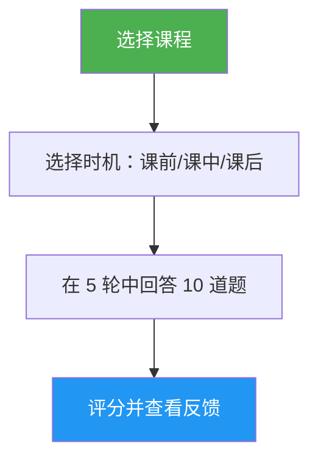

# 课程测验

> 交互式测验，通过 10 道题目、每题反馈和定向复习指导来测试你对特定 Claude Code 课程的理解。

## 亮点

- 每课 10 道题目，融合概念理解与实际应用
- 覆盖全部 10 节课程（01-Slash 命令 到 10-CLI）
- 三种计时模式：课前测试、进度检查或掌握度验证
- 每题附带正确答案和解释的反馈
- 指向具体课程章节的定向复习建议
- 所有课程的 100 道题库，位于 `references/question-bank.md`

## 何时使用

| 当你这么说... | 此技能将... |
|---|---|
| "测验我关于 hooks 的内容" | 针对第 06 课：Hooks 运行 10 道题的测验 |
| "课程测验 03" | 测试你对第 03 课：Skills 的知识掌握 |
| "我理解 MCP 了吗" | 评估你对第 05 课：MCP 的理解 |
| "练习题" | 让你选择一门课程，然后进行测验 |

## 工作原理



## 用法

```
/lesson-quiz [课程名称或编号]
```

示例：
```
/lesson-quiz hooks
/lesson-quiz 03
/lesson-quiz advanced-features
/lesson-quiz           # （提示选择课程）
```

## 输出

### 成绩报告
- 满分 10 分的总分及评级（精通 / 熟练 / 发展中 / 入门）
- 按题目类别（概念 vs. 实践）的细分

### 每题反馈
对每道错误答案：
- 你的答案 vs. 正确答案
- 解释正确答案为什么是对的
- 需要复习的具体课程章节

### 时机感知指导
- **课前测试**：建立基线，突出学习时需要关注的领域
- **课中测试**：识别你已经掌握的内容以及需要重温的内容
- **课后测试**：确认掌握程度或找出剩余的差距

## 资源

| 路径 | 描述 |
|---|---|
| `references/question-bank.md` | 100 道预编写题目（每课 10 道），附有答案、解释和复习指引 |
