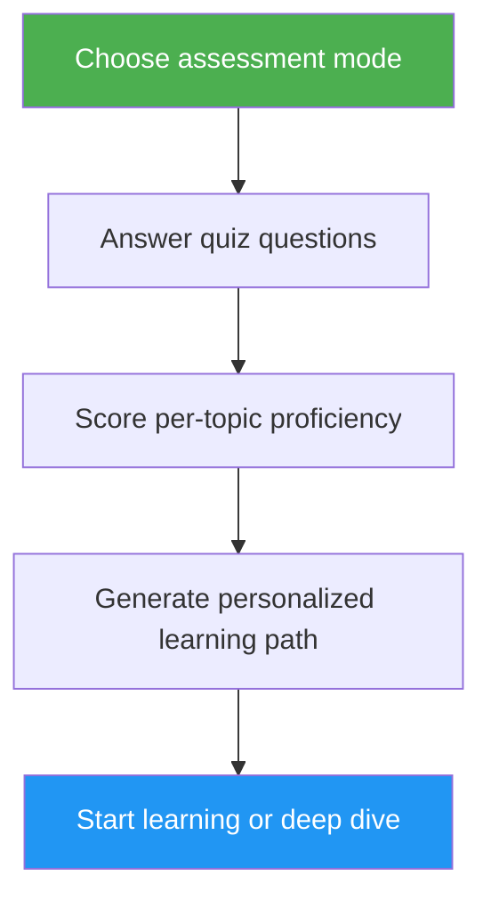

# 自我评估与学习路径顾问

> 全面的 Claude Code 能力评估，涵盖 10 个功能领域，识别技能差距，并生成个性化的进阶学习路径。

## 亮点

- 两种评估模式：快速模式（8 道题，2 分钟）和深度模式（5 轮，5 分钟）
- 评估 10 个功能领域：斜杠命令、记忆、技能、钩子、MCP、子代理、检查点、高级功能、插件、CLI
- 按主题评分，含掌握程度（无 / 基础 / 熟练）
- 差距分析，含依赖感知的优先级排序
- 个性化学习路径，含具体练习和成功标准
- 后续操作：开始学习、深入探索、实践项目或重新评估

## 使用场景

| 这样说... | 技能将... |
|---|---|
| "assess my level" | 运行评估测验并确定你的水平 |
| "where should I start" | 评估你的经验并建议一个起点 |
| "check my skills" | 生成涵盖全部 10 个领域的详细技能画像 |
| "what should I learn next" | 识别差距并构建按优先级排序的学习路径 |

## 工作原理



## 评估模式

### 快速评估（约 2 分钟）
- 跨越 2 轮的 8 道是/否经验题
- 确定整体水平：初级 / 中级 / 高级
- 列出具体的差距及教程链接
- 最适合：首次使用者、快速检查

### 深度评估（约 5 分钟）
- 5 轮问题，覆盖 10 个功能领域（每轮 2 个主题）
- 按主题评分（每题 0-2 分，共 20 分）
- 掌握程度表，包含强项领域、优先差距和待回顾项
- 依赖感知的学习路径，含阶段划分和时间估算
- 推荐结合差距主题的实践项目
- 最适合：希望进阶的经验用户、定期技能回顾

## 用法

```
/self-assessment
```

## 输出

### 技能画像表
显示每个主题的得分、掌握程度和状态（学习 / 回顾 / 已掌握）。

### 个性化学习路径
- 按依赖顺序组织为不同阶段
- 每个主题包含：教程链接、重点领域、关键练习、成功标准
- 对已掌握主题调整时间估算
- 结合多个差距领域的实践项目

### 后续操作
查看结果后，可选择：
- 开始第一个差距教程，含引导练习
- 深入探索某个特定差距领域
- 设置一个覆盖你差距的实践项目
- 切换评估模式重新评估
