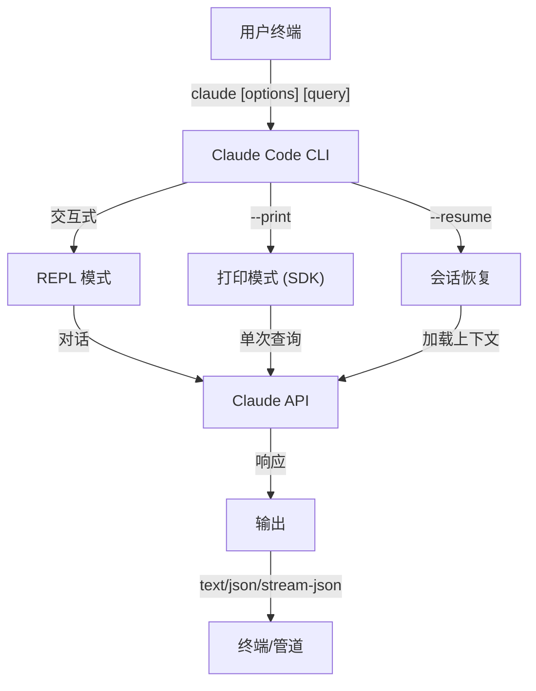
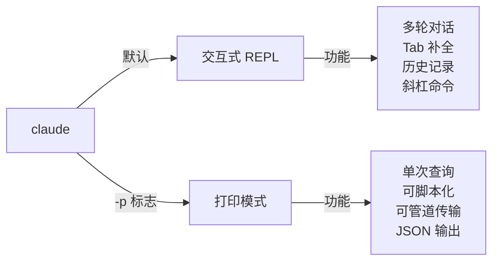

<picture>
  <source media="(prefers-color-scheme: dark)" srcset="../resources/logos/claude-howto-logo-dark.svg">
  
</picture>

# CLI 参考

## 概览

Claude Code CLI（命令行界面）是与 Claude Code 交互的主要方式。它提供了强大的选项，用于运行查询、管理会话、配置模型以及将 Claude 集成到你的开发工作流中。

## 架构



## 运行时与打包

自 **v2.1.113** 起，Claude Code CLI 通过可选的 npm 依赖启动**原生平台二进制文件**（macOS、Linux、Windows）。二进制文件在安装时匹配你的操作系统和架构——旧的捆绑 JavaScript 运行时不再是 macOS 或 Linux 上的默认选项。

**用户安装方式不变**：`npm install -g @anthropic-ai/claude-code` 依然有效，并且是推荐的安装路径。npm 在后台获取适合你平台的原生二进制文件。

**下载地址**（v2.1.116+）：原生二进制文件从 `https://downloads.claude.ai/claude-code-releases` 提供。

> **企业/代理用户**：如果你的网络需要明确的允许列表，请将 `downloads.claude.ai`（以及 `https://downloads.claude.ai/claude-code-releases`）添加到你的代理出口规则中。之前仅将 `storage.googleapis.com` 或 npm 注册中心列入允许列表的环境将需要更新，否则 `claude update` 和初始安装将会失败。

旧的 JavaScript 包仍为 Windows 以及锁定使用它的环境提供；这些安装方式继续将 Glob 和 Grep 作为一等工具提供（参见[工具与权限管理](#工具与权限管理)下方的 Glob/Grep 脚注）。

## CLI 命令

| 命令 | 描述 | 示例 |
|---------|-------------|---------|
| `claude` | 启动交互式 REPL | `claude` |
| `claude "query"` | 以初始提示启动 REPL | `claude "explain this project"` |
| `claude -p "query"` | 打印模式 - 查询后退出 | `claude -p "explain this function"` |
| `cat file \| claude -p "query"` | 处理管道内容 | `cat logs.txt \| claude -p "explain"` |
| `claude -c` | 继续最近的对话 | `claude -c` |
| `claude -c -p "query"` | 以打印模式继续 | `claude -c -p "check for type errors"` |
| `claude -r "<session>" "query"` | 通过 ID 或名称恢复会话 | `claude -r "auth-refactor" "finish this PR"` |
| `claude update` | 更新到最新版本 | `claude update` |
| `/doctor`（斜杠命令） | 诊断安装、配置和插件健康状况。自 v2.1.116 起，可以在 **Claude 正在响应时**打开，内联显示状态图标，并接受 `f` 键自动修复检测到的问题 | 在 REPL 中运行 `/doctor` |
| `claude mcp` | 配置 MCP 服务器 | 参见 [MCP 文档](../05-mcp/) |
| `claude mcp serve` | 将 Claude Code 作为 MCP 服务器运行 | `claude mcp serve` |
| `claude agents` | 打开**代理视图**（研究预览，v2.1.139+）——多会话管理器，列出每个 Claude Code 会话及其状态。参见下方[代理视图](#代理视图-claude-agents-v21139)。 | `claude agents` |
| `claude auto-mode defaults` | 以 JSON 格式打印自动模式默认规则 | `claude auto-mode defaults` |
| `claude remote-control` | 启动远程控制服务器 | `claude remote-control` |
| `claude plugin` | 管理插件（安装、启用、禁用） | `claude plugin install my-plugin` |
| `claude plugin init <name>` | 在 `.claude/skills` 中搭建新插件——自动加载，无需市场（v2.1.157+） | `claude plugin init my-plugin` |
| `claude plugin tag <version>` | 为插件创建发布 git 标签并进行版本验证（v2.1.118+） | `claude plugin tag v0.3.0` |
| `claude install [version]` | 安装特定版本的原生二进制文件。接受 `stable`、`latest` 或明确的版本字符串 | `claude install 2.1.131` |
| `claude project purge [path]` | 删除项目的所有本地 Claude Code 状态（记录、任务、调试日志、文件编辑历史、提示历史和 `~/.claude.json` 条目）。省略 `[path]` 则使用交互式选择器。标志：`--dry-run` 预览，`-y/--yes` 跳过确认，`-i/--interactive` 逐项确认，`--all` 处理所有项目（v2.1.126+） | `claude project purge ~/work/repo --dry-run` |
| `claude plugin prune` | 移除孤立的自动安装插件依赖（父插件已删除）。`plugin uninstall --prune` 在卸载目标后执行相同的级联清理（v2.1.121+） | `claude plugin prune` |
| `claude ultrareview [target]` | 以非交互方式运行 `/ultrareview`。将发现输出到 stdout，成功时退出码 0 / 失败时退出码 1。使用 `--json` 获取原始数据，`--timeout <minutes>` 覆盖默认的 30 分钟（v2.1.120+） | `claude ultrareview 1234 --json` |
| `claude auth login` | 登录（支持 `--email`、`--sso`）。自 v2.1.126 起，当浏览器回调无法到达 localhost 时（WSL2、SSH、容器），接受粘贴到终端的 OAuth 代码作为回退方案 | `claude auth login --email user@example.com` |
| `claude auth logout` | 登出当前账户 | `claude auth logout` |
| `claude auth status` | 检查认证状态（已登录退出码 0，否则退出码 1） | `claude auth status` |

## 核心标志

| 标志 | 描述 | 示例 |
|------|-------------|---------|
| `-p, --print` | 打印响应而不进入交互模式 | `claude -p "query"` |
| `-c, --continue` | 加载最近的对话 | `claude --continue` |
| `-r, --resume` | 通过 ID 或名称恢复特定会话 | `claude --resume auth-refactor` |
| `-v, --version` | 输出版本号 | `claude -v` |
| `-w, --worktree` | 在隔离的 git 工作树中启动 | `claude -w` |
| `-n, --name` | 会话显示名称 | `claude -n "auth-refactor"` |
| `--from-pr <url-or-number>` | 恢复链接到拉取/合并请求的会话。自 v2.1.119 起接受 GitHub（云版 + 企业版）、GitLab MR 和 Bitbucket PR URL；此前仅支持 GitHub.com | `claude --from-pr 42` 或 `claude --from-pr https://gitlab.example.com/org/repo/-/merge_requests/17` |
| `--remote "task"` | 在 claude.ai 上创建 Web 会话 | `claude --remote "implement API"` |
| `--remote-control, --rc` | 带远程控制的交互式会话 | `claude --rc` |
| `--teleport` | 在本地恢复 Web 会话 | `claude --teleport` |
| `--teammate-mode` | 代理团队显示模式 | `claude --teammate-mode tmux` |
| `--bare` | 最小模式（跳过 hooks、skills、插件、MCP、自动记忆、CLAUDE.md） | `claude --bare` |
| `--enable-auto-mode` | 解锁自动权限模式（Max 订阅者在 Opus 4.7 上不再需要此标志） | `claude --enable-auto-mode` |
| `--channels` | 订阅 MCP 频道插件 | `claude --channels discord,telegram` |
| `--chrome` / `--no-chrome` | 启用/禁用 Chrome 浏览器集成 | `claude --chrome` |
| `--effort` | 设置思考强度级别 | `claude --effort high` |
| `--init` / `--init-only` | 运行初始化 hooks | `claude --init` |
| `--maintenance` | 运行维护 hooks 并退出 | `claude --maintenance` |
| `--disable-slash-commands` | 禁用所有 skills 和斜杠命令 | `claude --disable-slash-commands` |
| `--no-session-persistence` | 禁用会话保存（打印模式） | `claude -p --no-session-persistence "query"` |
| `--exclude-dynamic-system-prompt-sections` | 从系统提示中排除动态部分，以提高提示缓存命中率 | `claude -p --exclude-dynamic-system-prompt-sections "query"` |

### 交互模式与打印模式



**交互模式**（默认）：
```bash
# 启动交互式会话
claude

# 以初始提示启动
claude "explain the authentication flow"
```

**打印模式**（非交互式）：
```bash
# 单次查询，然后退出
claude -p "what does this function do?"

# 处理文件内容
cat error.log | claude -p "explain this error"

# 与其他工具链式调用
claude -p "list todos" | grep "URGENT"
```

## 模型与配置

| 标志 | 描述 | 示例 |
|------|-------------|---------|
| `--model` | 设置模型（sonnet、opus、haiku 或完整名称） | `claude --model opus` |
| `--fallback-model` | 模型过载时自动回退 | `claude -p --fallback-model sonnet "query"` |
| `--agent` | 指定会话使用的代理 | `claude --agent my-custom-agent` |
| `--agents` | 通过 JSON 定义自定义子代理 | 参见[代理配置](#代理配置) |
| `--effort` | 设置努力级别（low、medium、high、xhigh、max） | `claude --effort xhigh` |

### 模型选择示例

```bash
# 对复杂任务使用 Opus 4.8
claude --model opus "design a caching strategy"

# 对快速任务使用 Haiku 4.5
claude --model haiku -p "format this JSON"

# 完整模型名称
claude --model claude-sonnet-4-6-20250929 "review this code"

# 使用回退以提高可靠性
claude -p --model opus --fallback-model sonnet "analyze architecture"

# 使用 opusplan（Opus 规划，Sonnet 执行）
claude --model opusplan "design and implement the caching layer"
```

> **网关模型发现（v2.1.129+，需主动选择）**：当 `ANTHROPIC_BASE_URL` 指向兼容 Anthropic 的网关时，设置 `CLAUDE_CODE_ENABLE_GATEWAY_MODEL_DISCOVERY=1` 从网关的 `/v1/models` 端点填充 `/model`。如果不设置该环境变量，`/model` 回退到内置的静态列表。此标志为主动选择（在 v2.1.129 中更改），因为发现调用可能会展示用户无权使用的模型；v2.1.126 曾将其设为隐式启用，该行为已被回退。

## 系统提示自定义

| 标志 | 描述 | 示例 |
|------|-------------|---------|
| `--system-prompt` | 替换整个默认提示 | `claude --system-prompt "You are a Python expert"` |
| `--system-prompt-file` | 从文件加载提示（打印模式） | `claude -p --system-prompt-file ./prompt.txt "query"` |
| `--append-system-prompt` | 追加到默认提示之后 | `claude --append-system-prompt "Always use TypeScript"` |

### 系统提示示例

```bash
# 完全自定义的角色
claude --system-prompt "You are a senior security engineer. Focus on vulnerabilities."

# 追加特定指令
claude --append-system-prompt "Always include unit tests with code examples"

# 从文件加载复杂提示
claude -p --system-prompt-file ./prompts/code-reviewer.txt "review main.py"
```

### 系统提示标志对比

| 标志 | 行为 | 交互模式 | 打印模式 |
|------|----------|-------------|-------|
| `--system-prompt` | 替换整个默认系统提示 | ✅ | ✅ |
| `--system-prompt-file` | 用文件内容替换系统提示 | ❌ | ✅ |
| `--append-system-prompt` | 追加到默认系统提示之后 | ✅ | ✅ |

**`--system-prompt-file` 仅在打印模式下使用。对于交互模式，请使用 `--system-prompt` 或 `--append-system-prompt`。**

## 工具与权限管理

| 标志 | 描述 | 示例 |
|------|-------------|---------|
| `--tools` | 限制可用的内置工具 | `claude -p --tools "Bash,Edit,Read" "query"` |
| `--allowedTools` | 无需提示即可执行的工具 | `"Bash(git log:*)" "Read"` |
| `--disallowedTools` | 从上下文中移除的工具 | `"Bash(rm:*)" "Edit"` |
| `--dangerously-skip-permissions` | 跳过所有权限提示 | `claude --dangerously-skip-permissions` |
| `--permission-mode` | 以指定的权限模式启动 | `claude --permission-mode auto` |
| `--permission-prompt-tool` | 用于权限处理的 MCP 工具 | `claude -p --permission-prompt-tool mcp_auth "query"` |
| `--enable-auto-mode` | 解锁自动权限模式 | `claude --enable-auto-mode` |

> **Glob / Grep 脚注（v2.1.113+）**：在原生 macOS/Linux 构建中，`Glob` 和 `Grep` 作为嵌入的 `bfs` 和 `ugrep` 二进制文件通过 Bash 工具提供，而非作为独立的一等工具。Windows 和 npm 捆绑（JS）安装仍将它们作为独立工具提供。对于子代理的 `allowedTools` / `disallowedTools` 列表，后端替换是透明的——你可以在每个平台上继续在配置中引用 `Glob` / `Grep`。

> **PowerShell 自动批准（v2.1.119）**：PowerShell 工具命令可以在权限模式下自动批准，方式与 Bash 命令完全相同。使用与 `Bash(...)` 规则相同的匹配器语法来限定 PowerShell 权限——例如 `PowerShell(Get-ChildItem:*)`。

> **恢复会话时的 `--permission-mode`（v2.1.132+）**：`claude -p --continue --permission-mode plan`（及 `--resume`）现在会尊重该标志。早期版本在恢复会话时会静默丢弃 `--permission-mode`，因此恢复以 plan 模式启动的会话时如果不重新传递该标志，会静默降级——该问题已修复。

### 权限示例

```bash
# 代码审查时的只读模式
claude --permission-mode plan "review this codebase"

# 仅限安全工具
claude --tools "Read,Grep,Glob" -p "find all TODO comments"

# 允许特定 git 命令而无需提示
claude --allowedTools "Bash(git status:*)" "Bash(git log:*)"

# 阻止危险操作
claude --disallowedTools "Bash(rm -rf:*)" "Bash(git push --force:*)"
```

## 输出与格式

| 标志 | 描述 | 选项 | 示例 |
|------|-------------|---------|---------|
| `--output-format` | 指定输出格式（打印模式） | `text`、`json`、`stream-json` | `claude -p --output-format json "query"` |
| `--input-format` | 指定输入格式（打印模式） | `text`、`stream-json` | `claude -p --input-format stream-json` |
| `--verbose` | 启用详细日志 | | `claude --verbose` |
| `--include-partial-messages` | 包含流式事件 | 需要 `stream-json` | `claude -p --output-format stream-json --include-partial-messages "query"` |
| `--json-schema` | 获取匹配 schema 的已验证 JSON | | `claude -p --json-schema '{"type":"object"}' "query"` |
| `--max-budget-usd` | 打印模式的最大消费限额 | | `claude -p --max-budget-usd 5.00 "query"` |

### 输出格式示例

```bash
# 纯文本（默认）
claude -p "explain this code"

# 程序化使用的 JSON
claude -p --output-format json "list all functions in main.py"

# 实时处理的流式 JSON
claude -p --output-format stream-json "generate a long report"

# 带 schema 验证的结构化输出
claude -p --json-schema '{"type":"object","properties":{"bugs":{"type":"array"}}}' \
  "find bugs in this code and return as JSON"
```

## 工作区与目录

| 标志 | 描述 | 示例 |
|------|-------------|---------|
| `--add-dir` | 添加额外的工作目录 | `claude --add-dir ../apps ../lib` |
| `--setting-sources` | 逗号分隔的设置来源 | `claude --setting-sources user,project` |

> **`/config` 持久化（v2.1.119）**：通过 `/config` 命令交互式做出的更改现在会写入 `~/.claude/settings.json`，并参与正常的优先级链（policy → local → project → user）。在 v2.1.119 之前，部分 `/config` 更改仅在会话期间有效。完整优先级顺序请参见[记忆与设置](../02-memory/README.md)。
| `--settings` | 从文件或 JSON 加载设置 | `claude --settings ./settings.json` |
| `--plugin-dir` | 从目录加载插件（可重复使用） | `claude --plugin-dir ./my-plugin` |

### 多目录示例

```bash
# 跨多个项目目录工作
claude --add-dir ../frontend ../backend ../shared "find all API endpoints"

# 加载自定义设置
claude --settings '{"model":"opus","verbose":true}' "complex task"
```

## MCP 配置

| 标志 | 描述 | 示例 |
|------|-------------|---------|
| `--mcp-config` | 从 JSON 加载 MCP 服务器 | `claude --mcp-config ./mcp.json` |
| `--strict-mcp-config` | 仅使用指定的 MCP 配置 | `claude --strict-mcp-config --mcp-config ./mcp.json` |
| `--channels` | 订阅 MCP 频道插件 | `claude --channels discord,telegram` |

### MCP 示例

```bash
# 加载 GitHub MCP 服务器
claude --mcp-config ./github-mcp.json "list open PRs"

# 严格模式 - 仅使用指定的服务器
claude --strict-mcp-config --mcp-config ./production-mcp.json "deploy to staging"
```

## 会话管理

| 标志 | 描述 | 示例 |
|------|-------------|---------|
| `--session-id` | 使用特定的会话 ID（UUID） | `claude --session-id "550e8400-..."` |
| `--fork-session` | 恢复时创建新会话 | `claude --resume abc123 --fork-session` |

### 会话示例

```bash
# 继续上次对话
claude -c

# 恢复已命名会话
claude -r "feature-auth" "continue implementing login"

# 分支会话以便实验
claude --resume feature-auth --fork-session "try alternative approach"

# 使用特定会话 ID
claude --session-id "550e8400-e29b-41d4-a716-446655440000" "continue"
```

### 会话分支

从现有会话创建分支以进行实验：

```bash
# 分支一个会话来尝试不同的方法
claude --resume abc123 --fork-session "try alternative implementation"

# 使用自定义消息进行分支
claude -r "feature-auth" --fork-session "test with different architecture"
```

**使用场景：**
- 尝试替代实现而不丢失原始会话
- 并行尝试不同的方法
- 从成功的工作中创建分支以进行变体
- 在不影响主会话的情况下测试破坏性更改

原始会话保持不变，分支成为新的独立会话。

### 项目状态清理（v2.1.126+）

`claude project purge` 删除项目的所有本地 Claude Code 状态——记录、任务列表、调试日志、文件编辑历史、提示历史行，以及项目的 `~/.claude.json` 条目。先用 `--dry-run` 预览删除内容；`--all` 遍历机器上的每个项目。

```bash
# 预览将要删除的内容（安全）
claude project purge ~/work/repo --dry-run

# 删除特定项目的状态，无需确认
claude project purge ~/work/repo --yes

# 交互式遍历每个项目
claude project purge --all --interactive
```

## 高级功能

| 标志 | 描述 | 示例 |
|------|-------------|---------|
| `--chrome` | 启用 Chrome 浏览器集成 | `claude --chrome` |
| `--no-chrome` | 禁用 Chrome 浏览器集成 | `claude --no-chrome` |
| `--ide` | 自动连接到 IDE（如果可用） | `claude --ide` |
| `--max-turns` | 限制代理轮次（非交互式） | `claude -p --max-turns 3 "query"` |
| `--debug` | 启用带过滤的调试模式 | `claude --debug "api,mcp"` |
| `--enable-lsp-logging` | 启用详细 LSP 日志 | `claude --enable-lsp-logging` |
| `--betas` | API 请求的 Beta 头 | `claude --betas interleaved-thinking` |
| `--plugin-dir` | 从目录加载插件（可重复使用） | `claude --plugin-dir ./my-plugin` |
| `--enable-auto-mode` | 解锁自动权限模式 | `claude --enable-auto-mode` |
| `--effort` | 设置思考强度级别 | `claude --effort high` |
| `--bare` | 最小模式（跳过 hooks、skills、插件、MCP、自动记忆、CLAUDE.md） | `claude --bare` |
| `--channels` | 订阅 MCP 频道插件 | `claude --channels discord` |
| `--tmux` | 为工作树创建 tmux 会话 | `claude --tmux` |
| `--fork-session` | 恢复时创建新会话 ID | `claude --resume abc --fork-session` |
| `--max-budget-usd` | 最大消费限额（打印模式） | `claude -p --max-budget-usd 5.00 "query"` |
| `--json-schema` | 已验证的 JSON 输出 | `claude -p --json-schema '{"type":"object"}' "q"` |

### 平台与主题说明（v2.1.112）

- **Windows 上的 PowerShell 工具**：一个专用的 PowerShell 工具正在 Windows 上推出，可通过环境变量控制。
- **自动（匹配终端）主题**：新的"自动（匹配终端）"主题将 Claude Code 的明暗外观与你的终端同步。
- **更安静的权限提示**：只读的 `Bash` 调用和 `Glob` 模式不再触发权限提示。

### 高级示例

```bash
# 限制自主操作
claude -p --max-turns 5 "refactor this module"

# 调试 API 调用
claude --debug "api" "test query"

# 启用 IDE 集成
claude --ide "help me with this file"
```

## 代理配置

`--agents` 标志接受一个 JSON 对象，为会话定义自定义子代理。

### 代理 JSON 格式

```json
{
  "agent-name": {
    "description": "必填：何时调用此代理",
    "prompt": "必填：代理的系统提示",
    "tools": ["可选", "工具", "数组"],
    "model": "可选: sonnet|opus|haiku"
  }
}
```

**必填字段：**
- `description` - 自然语言描述何时使用此代理
- `prompt` - 定义代理角色和行为的系统提示

**可选字段：**
- `tools` - 可用工具数组（省略则继承全部工具）
  - 格式：`["Read", "Grep", "Glob", "Bash"]`
- `model` - 使用的模型：`sonnet`、`opus` 或 `haiku`

### 完整代理示例

```json
{
  "code-reviewer": {
    "description": "专业代码审查员。在代码更改后主动使用。",
    "prompt": "你是一位高级代码审查员。关注代码质量、安全性和最佳实践。",
    "tools": ["Read", "Grep", "Glob", "Bash"],
    "model": "sonnet"
  },
  "debugger": {
    "description": "针对错误和测试失败的调试专家。",
    "prompt": "你是一位专家调试员。分析错误，识别根本原因，并提供修复方案。",
    "tools": ["Read", "Edit", "Bash", "Grep"],
    "model": "opus"
  },
  "documenter": {
    "description": "用于生成指南的文档专家。",
    "prompt": "你是一位技术文档编写者。创建清晰、全面的文档。",
    "tools": ["Read", "Write"],
    "model": "haiku"
  }
}
```

### 代理命令示例

```bash
# 内联定义自定义代理
claude --agents '{
  "security-auditor": {
    "description": "用于漏洞分析的安全专家",
    "prompt": "你是一位安全专家。找出漏洞并提出修复建议。",
    "tools": ["Read", "Grep", "Glob"],
    "model": "opus"
  }
}' "audit this codebase for security issues"

# 从文件加载代理
claude --agents "$(cat ~/.claude/agents.json)" "review the auth module"

# 与其他标志组合
claude -p --agents "$(cat agents.json)" --model sonnet "analyze performance"
```

### 代理优先级

当存在多个代理定义时，按以下优先级顺序加载：
1. **CLI 定义的**（`--agents` 标志）——特定于会话
2. **项目级别的**（`.claude/agents/`）——当前项目
3. **用户级别的**（`~/.claude/agents/`）——所有项目

CLI 定义的代理在会话中覆盖项目和用户代理。当名称冲突时，项目级别的代理覆盖用户级别的代理。完整优先级表（包括插件级别的代理）请参见[第四课——子代理](../04-subagents/README.md#file-locations)。

### 代理视图（`claude agents`，v2.1.139+）

> **研究预览**——该功能足够稳定可供日常使用，但可能发生变化。

`claude agents` 打开**代理视图**——机器上每个 Claude Code 会话的单一列表及其当前状态（`running`、`blocked on you`、`done`）。它用于替代在多个终端标签页之间切换来管理后台代理、定时任务或 `--bg` 启动的会话。

```bash
# 打开代理视图
claude agents
```

当你从代理视图（或通过 `claude --bg <prompt>`）分派会话时，可以传递与 `claude` 本身相同的配置标志。为代理视图分派路径引入的标志：

| 标志 | 自版本 | 描述 |
|------|-------|-------------|
| `--cwd <path>` | v2.1.141 | 将会话列表（或新会话）限定到特定工作目录 |
| `--add-dir <path>` | v2.1.142 | 向分派会话的工作区添加目录 |
| `--settings <path>` | v2.1.142 | 为分派会话使用特定的 `settings.json` |
| `--mcp-config <path>` | v2.1.142 | 为分派会话使用特定的 MCP 配置 |
| `--plugin-dir <path>` | v2.1.142 | 为分派会话使用特定的插件目录 |
| `--permission-mode <mode>` | v2.1.142 | 为分派会话设置权限模式（`plan`、`acceptEdits`、`auto` 等） |
| `--model <model>` | v2.1.142 | 为分派会话固定模型 |
| `--effort <level>` | v2.1.142 | 固定努力级别（`low`/`medium`/`high`/`xhigh`/`max`） |
| `--dangerously-skip-permissions` | v2.1.142 | 在无权限提示的情况下运行分派会话（仅在沙箱中使用） |
| `--json` | v2.1.145 | 以机器可读的 JSON 格式打印代理列表，用于脚本编写（状态栏、会话选择器、tmux-resurrect 集成） |

完成工作但留下后台 shell 打开的会话从"Working"转移到"Completed"（v2.1.141 修复）。在已连接的代理会话中，`Shift+Tab` 循环切换权限模式，包括自动模式（v2.1.143）。

**固定会话**——在 `claude agents` 中的会话上按 `Ctrl+T` 以固定它（v2.1.147）。固定的后台会话在空闲时保持活动状态，原地重启以应用 Claude Code 更新，并在内存压力下仅在非固定会话之后才被清除。（此 `Ctrl+T` 仅用于代理视图；在主会话中它切换任务列表视图。）

---

## 高价值使用场景

### 1. CI/CD 集成

在你的 CI/CD 流水线中使用 Claude Code 进行自动化代码审查、测试和文档编写。

**GitHub Actions 示例：**

```yaml
name: AI Code Review

on: [pull_request]

jobs:
  review:
    runs-on: ubuntu-latest
    steps:
      - uses: actions/checkout@v4

      - name: Install Claude Code
        run: npm install -g @anthropic-ai/claude-code

      - name: Run Code Review
        env:
          ANTHROPIC_API_KEY: ${{ secrets.ANTHROPIC_API_KEY }}
        run: |
          claude -p --output-format json \
            --max-turns 1 \
            "Review the changes in this PR for:
            - Security vulnerabilities
            - Performance issues
            - Code quality
            Output as JSON with 'issues' array" > review.json

      - name: Post Review Comment
        uses: actions/github-script@v7
        with:
          script: |
            const fs = require('fs');
            const review = JSON.parse(fs.readFileSync('review.json', 'utf8'));
            // Process and post review comments
```

**Jenkins 流水线：**

```groovy
pipeline {
    agent any
    stages {
        stage('AI Review') {
            steps {
                sh '''
                    claude -p --output-format json \
                      --max-turns 3 \
                      "Analyze test coverage and suggest missing tests" \
                      > coverage-analysis.json
                '''
            }
        }
    }
}
```

**无头 `ultrareview`（v2.1.120+）：**

```yaml
# .github/workflows/ultrareview.yml
- name: Claude ultrareview
  run: claude ultrareview ${{ github.event.pull_request.number }} --json > review.json
```

`claude ultrareview` 在审查干净时退出码为 0，在报告发现时退出码为 1，因此可以直接作为 PR 的关卡。使用 `--timeout <minutes>` 覆盖默认的 30 分钟。

### 2. 脚本管道

通过 Claude 处理文件、日志和数据以进行分析。

**日志分析：**

```bash
# 分析错误日志
tail -1000 /var/log/app/error.log | claude -p "summarize these errors and suggest fixes"

# 在访问日志中查找模式
cat access.log | claude -p "identify suspicious access patterns"

# 分析 git 历史
git log --oneline -50 | claude -p "summarize recent development activity"
```

**代码处理：**

```bash
# 审查特定文件
cat src/auth.ts | claude -p "review this authentication code for security issues"

# 生成文档
cat src/api/*.ts | claude -p "generate API documentation in markdown"

# 查找 TODO 并排序优先级
grep -r "TODO" src/ | claude -p "prioritize these TODOs by importance"
```

### 3. 多会话工作流

通过多个对话线程管理复杂项目。

```bash
# 启动功能分支会话
claude -r "feature-auth" "let's implement user authentication"

# 稍后继续会话
claude -r "feature-auth" "add password reset functionality"

# 分支以尝试替代方法
claude --resume feature-auth --fork-session "try OAuth instead"

# 在不同功能会话之间切换
claude -r "feature-payments" "continue with Stripe integration"
```

### 4. 自定义代理配置

为你的团队工作流定义专门的代理。

```bash
# 将代理配置保存到文件
cat > ~/.claude/agents.json << 'EOF'
{
  "reviewer": {
    "description": "Code reviewer for PR reviews",
    "prompt": "Review code for quality, security, and maintainability.",
    "model": "opus"
  },
  "documenter": {
    "description": "Documentation specialist",
    "prompt": "Generate clear, comprehensive documentation.",
    "model": "sonnet"
  },
  "refactorer": {
    "description": "Code refactoring expert",
    "prompt": "Suggest and implement clean code refactoring.",
    "tools": ["Read", "Edit", "Glob"]
  }
}
EOF

# 在会话中使用代理
claude --agents "$(cat ~/.claude/agents.json)" "review the auth module"
```

### 5. 批处理

使用一致的设置处理多个查询。

```bash
# 处理多个文件
for file in src/*.ts; do
  echo "Processing $file..."
  claude -p --model haiku "summarize this file: $(cat $file)" >> summaries.md
done

# 批量代码审查
find src -name "*.py" -exec sh -c '
  echo "## $1" >> review.md
  cat "$1" | claude -p "brief code review" >> review.md
' _ {} \;

# 为所有模块生成测试
for module in $(ls src/modules/); do
  claude -p "generate unit tests for src/modules/$module" > "tests/$module.test.ts"
done
```

### 6. 安全意识的开发

使用权限控制确保安全操作。

```bash
# 只读安全审计
claude --permission-mode plan \
  --tools "Read,Grep,Glob" \
  "audit this codebase for security vulnerabilities"

# 阻止危险命令
claude --disallowedTools "Bash(rm:*)" "Bash(curl:*)" "Bash(wget:*)" \
  "help me clean up this project"

# 受限自动化
claude -p --max-turns 2 \
  --allowedTools "Read" "Glob" \
  "find all hardcoded credentials"
```

### 7. JSON API 集成

使用 `jq` 解析将 Claude 用作工具的可编程 API。

```bash
# 获取结构化分析
claude -p --output-format json \
  --json-schema '{"type":"object","properties":{"functions":{"type":"array"},"complexity":{"type":"string"}}}' \
  "analyze main.py and return function list with complexity rating"

# 与 jq 集成以进行处理
claude -p --output-format json "list all API endpoints" | jq '.endpoints[]'

# 在脚本中使用
RESULT=$(claude -p --output-format json "is this code secure? answer with {secure: boolean, issues: []}" < code.py)
if echo "$RESULT" | jq -e '.secure == false' > /dev/null; then
  echo "Security issues found!"
  echo "$RESULT" | jq '.issues[]'
fi
```

### jq 解析示例

使用 `jq` 解析和处理 Claude 的 JSON 输出：

```bash
# 提取特定字段
claude -p --output-format json "analyze this code" | jq '.result'

# 过滤数组元素
claude -p --output-format json "list issues" | jq -r '.issues[] | select(.severity=="high")'

# 提取多个字段
claude -p --output-format json "describe the project" | jq -r '.{name, version, description}'

# 转换为 CSV
claude -p --output-format json "list functions" | jq -r '.functions[] | [.name, .lineCount] | @csv'

# 条件处理
claude -p --output-format json "check security" | jq 'if .vulnerabilities | length > 0 then "UNSAFE" else "SAFE" end'

# 提取嵌套值
claude -p --output-format json "analyze performance" | jq '.metrics.cpu.usage'

# 处理整个数组
claude -p --output-format json "find todos" | jq '.todos | length'

# 转换输出
claude -p --output-format json "list improvements" | jq 'map({title: .title, priority: .priority})'
```

---

## 模型

Claude Code 支持多种具有不同能力的模型：

| 模型 | ID | 上下文窗口 | 备注 |
|-------|-----|----------------|-------|
| Opus 4.8 | `claude-opus-4-8` | 1M tokens | 最强大；自适应努力级别 `low → max`；默认努力 `high`（v2.1.154） |
| Sonnet 4.6 | `claude-sonnet-4-6` | 1M tokens | 速度与能力的平衡；Pro/Max 订阅者的默认努力级别在 v2.1.117 中从 `medium` 提升到 `high` |
| Haiku 4.5 | `claude-haiku-4-5` | 200K tokens | 最快，适合快速任务；无努力级别 |

### 模型选择

```bash
# 使用短名称
claude --model opus "complex architectural review"
claude --model sonnet "implement this feature"
claude --model haiku -p "format this JSON"

# 使用 opusplan 别名（Opus 规划，Sonnet 执行）
claude --model opusplan "design and implement the API"

# 在会话中切换快速模式
/fast
```

> **快速模式现运行于 Opus 4.8（v2.1.154）**：自 v2.1.154 起，`/fast` 默认运行 **Opus 4.8** 作为研究预览——约 2 倍的标准费率换取约 2.5 倍的输出速度。此前在 v2.1.142 中从 Opus 4.6 切换到 Opus 4.7。`CLAUDE_CODE_OPUS_4_6_FAST_MODE_OVERRIDE` 环境变量已于 **v2.1.154 中弃用，并于 2026-06-01 移除**；现在要在 Opus 4.6 上使用快速模式，请运行 `/model claude-opus-4-6[1m]` 然后 `/fast on`。

### 努力级别（Opus 4.8 / Opus 4.7）

Opus 4.8 和 Opus 4.7 支持自适应推理，具有以下努力级别（从轻到重）：`low`（○）、`medium`（◐）、`high`（●）、`xhigh` 和 `max`。**默认**在 Opus 4.8（自 v2.1.154）、Opus 4.6 和 Sonnet 4.6 上为 `high`，在 Opus 4.7 上为 `xhigh`。`xhigh` 在 Opus 4.8 和 Opus 4.7 上可用；`max` 在 Opus 4.8/4.7/4.6 和 Sonnet 4.6 上可用（仅限会话）。Haiku 4.5 没有努力级别。在 Opus 4.6 / Sonnet 4.6 上，Pro/Max 订阅者的默认努力级别在 v2.1.117 中从 `medium` 提升到 `high`。

```bash
# 通过 CLI 标志设置努力级别
claude --effort high "complex review"

# 通过斜杠命令设置努力级别
/effort high

# 通过环境变量设置努力级别
export CLAUDE_CODE_EFFORT_LEVEL=high   # low、medium、high、xhigh（Opus 4.8/4.7）或 max——Opus 4.8 上默认为 high
```

提示中的"ultrathink"关键词激活深度推理。`/effort` 菜单还提供 `ultracode`，它**不是**模型努力级别——它发送 `xhigh` 并让 Claude 编排动态工作流（仅限会话）。

---

## 关键环境变量

| 变量 | 描述 |
|----------|-------------|
| `ANTHROPIC_API_KEY` | 用于认证的 API 密钥 |
| `ANTHROPIC_MODEL` | 覆盖默认模型 |
| `ANTHROPIC_CUSTOM_MODEL_OPTION` | API 的自定义模型选项 |
| `ANTHROPIC_DEFAULT_OPUS_MODEL` | 覆盖默认 Opus 模型 ID |
| `ANTHROPIC_DEFAULT_SONNET_MODEL` | 覆盖默认 Sonnet 模型 ID |
| `ANTHROPIC_DEFAULT_HAIKU_MODEL` | 覆盖默认 Haiku 模型 ID |
| `MAX_THINKING_TOKENS` | 设置扩展思考的 token 预算 |
| `CLAUDE_CODE_EFFORT_LEVEL` | 设置努力级别（`low`/`medium`/`high`/`xhigh`/`max`）——Opus 4.8 上默认为 `high`（Opus 4.7 上为 `xhigh`）；`xhigh` 需要 Opus 4.8/4.7；`max` 在 Opus 4.8/4.7/4.6 和 Sonnet 4.6 上可用 |
| `CLAUDE_CODE_SIMPLE` | 最小模式，由 `--bare` 标志设置 |
| `CLAUDE_CODE_DISABLE_AUTO_MEMORY` | 禁用自动 CLAUDE.md 更新 |
| `CLAUDE_CODE_DISABLE_BACKGROUND_TASKS` | 禁用后台任务执行 |
| `CLAUDE_CODE_DISABLE_CRON` | 禁用定时/cron 任务 |
| `CLAUDE_CODE_DISABLE_GIT_INSTRUCTIONS` | 禁用 git 相关指令 |
| `CLAUDE_CODE_DISABLE_TERMINAL_TITLE` | 禁用终端标题更新 |
| `CLAUDE_CODE_DISABLE_1M_CONTEXT` | 禁用 1M token 上下文窗口 |
| `CLAUDE_CODE_DISABLE_NONSTREAMING_FALLBACK` | 禁用非流式回退 |
| `CLAUDE_CODE_ENABLE_TASKS` | 启用任务列表功能 |
| `CLAUDE_CODE_TASK_LIST_ID` | 跨会话共享的命名任务目录 |
| `CLAUDE_CODE_ENABLE_PROMPT_SUGGESTION` | 切换提示建议（`true`/`false`） |
| `CLAUDE_CODE_EXPERIMENTAL_AGENT_TEAMS` | 启用实验性代理团队 |
| `CLAUDE_CODE_NEW_INIT` | 使用新的初始化流程 |
| `CLAUDE_CODE_SUBAGENT_MODEL` | 子代理执行的模型 |
| `CLAUDE_CODE_PLUGIN_SEED_DIR` | 插件种子文件的目录 |
| `CLAUDE_CODE_SUBPROCESS_ENV_SCRUB` | 从子进程中清除的环境变量 |
| `CLAUDE_AUTOCOMPACT_PCT_OVERRIDE` | 覆盖自动压缩百分比 |
| `CLAUDE_STREAM_IDLE_TIMEOUT_MS` | 流空闲超时（毫秒） |
| `SLASH_COMMAND_TOOL_CHAR_BUDGET` | 斜杠命令工具的字符预算 |
| `ENABLE_TOOL_SEARCH` | 启用工具搜索功能 |
| `MAX_MCP_OUTPUT_TOKENS` | MCP 工具输出的最大 token 数 |
| `CLAUDE_CODE_PERFORCE_MODE` | 设置为 `1` 以启用 Perforce 模式——默认将文件视为只读（用于 Perforce/P4 版本控制工作流）（v2.1.98 新增） |
| `DISABLE_UPDATES` | 阻止所有更新路径，包括手动 `claude update`。比仅阻止后台自动更新的 `DISABLE_AUTOUPDATER` 更严格（v2.1.118+） |
| `CLAUDE_CODE_HIDE_CWD` | 设置为 `1` 时，在启动标志中隐藏当前工作目录（用于隐私/屏幕共享）（v2.1.119+） |
| `CLAUDE_CODE_FORK_SUBAGENT` | 设置为 `1` 以在外部构建（Bedrock、Vertex、Foundry）上启用分支子代理。在 Anthropic API 上无效，因为分支子代理已正式发布（v2.1.117+） |
| `CLAUDE_CODE_DISABLE_ALTERNATE_SCREEN` | 设置为 `1` 以退出全屏交替屏幕渲染器；会话保持在正常的终端回滚中。在管道传输记录到日志或与 `script(1)` 配合使用时有用（v2.1.132+） |
| `CLAUDE_CODE_SESSION_ID` | 在 Claude Code 启动的每个 Bash 工具子进程中设置；等于 hook 输入 JSON 中的 `session_id`。用于关联 bash 日志与 hook 遥测数据（v2.1.132+） |
| `CLAUDE_CODE_ENABLE_FEEDBACK_SURVEY_FOR_OTEL` | 设置为 `1` 以为捕获 OpenTelemetry 数据的组织重新启用 Anthropic 的会话质量调查。在 OTEL 部署中默认关闭（v2.1.136+） |
| `OTEL_LOG_TOOL_DETAILS` | 设置为 `1` 以在 OpenTelemetry 事件中取消对自定义和 MCP 命令名称的编辑。默认保持编辑（v2.1.117+） |
| `ANTHROPIC_BEDROCK_SERVICE_TIER` | 选择 Bedrock 服务层级：`default`、`flex` 或 `priority`（v2.1.122+） |
| `AI_AGENT` | 在子进程上自动设置，以便外部 CLI（例如 `gh`）可以将流量归因到 Claude Code（v2.1.120+） |
| `CLAUDE_CODE_FORCE_SYNC_OUTPUT` | 设置为 `1` 以为自动检测遗漏的终端（例如 Emacs `eat`）强制同步输出（v2.1.129+） |
| `CLAUDE_CODE_PACKAGE_MANAGER_AUTO_UPDATE` | 设置为 `1` 以为 Homebrew/WinGet 安装启用后台升级（这些通常不自动更新）（v2.1.129+） |
| `CLAUDE_CODE_ENABLE_GATEWAY_MODEL_DISCOVERY` | 设置为 `1` 以在设置了 `ANTHROPIC_BASE_URL` 时选择加入网关 `/v1/models` 发现。不设置时，`/model` 显示内置静态列表（v2.1.129+） |
| `CLAUDE_CODE_ENABLE_AUTO_MODE` | 设置为 `1` 以在 Bedrock、Vertex 和 Foundry 上为 Opus 4.7/4.8 选择加入自动模式（v2.1.158+） |
| `CLAUDE_CODE_OPUS_4_6_FAST_MODE_OVERRIDE` | **已移除（自 v2.1.160 起为无操作）。** 此前将快速模式（`/fast`）锁定到 Opus 4.6。现在要在 Opus 4.6 上使用快速模式，请运行 `/model claude-opus-4-6[1m]` 然后 `/fast on`。 |

> **Vertex AI 上的 `ENABLE_TOOL_SEARCH`（v2.1.119+）**：工具搜索在 Google Cloud Vertex AI 部署中**默认禁用**。希望在 Vertex 上使用工具搜索功能的用户必须通过 `export ENABLE_TOOL_SEARCH=true` 明确选择加入。在直接 Anthropic API 上它仍然默认启用。

---

## 速查参考

### 最常用命令

```bash
# 交互式会话
claude

# 快速提问
claude -p "how do I..."

# 继续对话
claude -c

# 处理文件
cat file.py | claude -p "review this"

# 用于脚本的 JSON 输出
claude -p --output-format json "query"
```

### 标志组合

| 使用场景 | 命令 |
|----------|---------|
| 快速代码审查 | `cat file \| claude -p "review"` |
| 结构化输出 | `claude -p --output-format json "query"` |
| 安全探索 | `claude --permission-mode plan` |
| 带安全措施的自主模式 | `claude --enable-auto-mode --permission-mode auto` |
| CI/CD 集成 | `claude -p --max-turns 3 --output-format json` |
| 恢复工作 | `claude -r "session-name"` |
| 自定义模型 | `claude --model opus "complex task"` |
| 最小模式 | `claude --bare "quick query"` |
| 预算限制运行 | `claude -p --max-budget-usd 2.00 "analyze code"` |

---

## 故障排除

### 命令未找到

**问题：** `claude: command not found`

**解决方案：**
- 安装 Claude Code：`npm install -g @anthropic-ai/claude-code`
- 检查 PATH 是否包含 npm 全局 bin 目录
- 尝试使用完整路径运行：`npx claude`

### API 密钥问题

**问题：** 认证失败

**解决方案：**
- 设置 API 密钥：`export ANTHROPIC_API_KEY=your-key`
- 检查密钥是否有效且具有足够的额度
- 验证密钥对所请求模型的权限

### 会话未找到

**问题：** 无法恢复会话

**解决方案：**
- 列出可用会话以找到正确的名称/ID
- 会话可能在一段时间不活动后过期
- 使用 `-c` 继续最近的会话

### 输出格式问题

**问题：** JSON 输出格式错误

**解决方案：**
- 使用 `--json-schema` 强制执行结构
- 在提示中添加明确的 JSON 指令
- 使用 `--output-format json`（而不仅仅是在提示中要求 JSON）

### 权限被拒绝

**问题：** 工具执行被阻止

**解决方案：**
- 检查 `--permission-mode` 设置
- 查看 `--allowedTools` 和 `--disallowedTools` 标志
- 对于自动化使用 `--dangerously-skip-permissions`（谨慎使用）

---

## 附加资源

- **[官方 CLI 参考](https://code.claude.com/docs/en/cli-reference)**——完整命令参考
- **[无头模式文档](https://code.claude.com/docs/en/headless)**——自动化执行
- **[斜杠命令](../01-slash-commands/)**——Claude 中的自定义快捷方式
- **[记忆指南](../02-memory/)**——通过 CLAUDE.md 实现持久上下文
- **[MCP 协议](../05-mcp/)**——外部工具集成
- **[高级功能](../09-advanced-features/)**——规划模式、扩展思考
- **[子代理指南](../04-subagents/)**——委派任务执行

---

*[Claude How To](../) 指南系列的一部分*

---

**最后更新**：2026 年 6 月 2 日
**Claude Code 版本**：2.1.160
**来源**：
- https://code.claude.com/docs/en/cli-reference
- https://code.claude.com/docs/en/settings
- https://code.claude.com/docs/en/changelog
- https://code.claude.com/docs/en/model-config
- https://platform.claude.com/docs/en/about-claude/models/overview
- https://www.anthropic.com/news/claude-opus-4-8
- https://github.com/anthropics/claude-code/releases/tag/v2.1.117
- https://github.com/anthropics/claude-code/releases/tag/v2.1.139
- https://github.com/anthropics/claude-code/releases/tag/v2.1.142
- https://github.com/anthropics/claude-code/releases/tag/v2.1.154
- https://code.claude.com/docs/en/plugins
- https://code.claude.com/docs/en/overview
**兼容模型**：Claude Sonnet 4.6、Claude Opus 4.8、Claude Haiku 4.5
