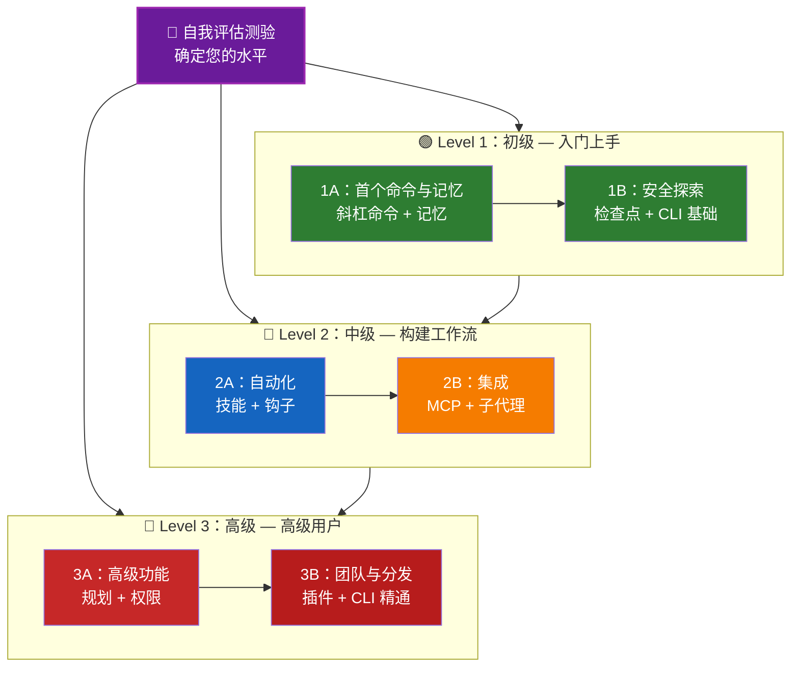

<picture>
  <source media="(prefers-color-scheme: dark)" srcset="resources/logos/claude-howto-logo-dark.svg">
  
</picture>

# 📚 Claude Code 学习路线图

**刚接触 Claude Code？** 本指南帮助您按自己的节奏掌握 Claude Code 的各项功能。无论您是零基础新手还是经验丰富的开发者，都请先完成下方的自我评估测验，找到最适合您的学习路径。

---

## 🧭 确定您的水平

每个人的起点各不相同。通过这个快速自我评估，找到最合适的切入点。

**诚实地回答以下问题：**

- [ ] 我能启动 Claude Code 并进行对话 (`claude`)
- [ ] 我创建或编辑过 CLAUDE.md 文件
- [ ] 我使用过至少 3 个内置斜杠命令（例如 /help、/compact、/model）
- [ ] 我创建过自定义斜杠命令或技能（SKILL.md）
- [ ] 我配置过 MCP 服务器（例如 GitHub、数据库）
- [ ] 我在 ~/.claude/settings.json 中设置过钩子
- [ ] 我创建或使用过自定义子代理（.claude/agents/）
- [ ] 我使用过打印模式（`claude -p`）进行脚本编写或 CI/CD

**您的水平：**

| 打勾数 | 水平 | 开始位置 | 预计完成时间 |
|--------|-------|----------|------------------|
| 0-2 | **Level 1：初级** — 入门上手 | [里程碑 1A](#milestone-1a-first-commands--memory) | 约 3 小时 |
| 3-5 | **Level 2：中级** — 构建工作流 | [里程碑 2A](#milestone-2a-automation-skills--hooks) | 约 5 小时 |
| 6-8 | **Level 3：高级** — 高级用户与团队负责人 | [里程碑 3A](#milestone-3a-advanced-features) | 约 5 小时 |

> **提示**：如果不确定，请从一个较低的水平开始。快速复习熟悉的内容总比错过基础概念要好。

> **互动版本**：在 Claude Code 中运行 `/self-assessment`，获取一个引导式的互动测验，评估您在所有 10 个功能领域的熟练程度，并生成个性化的学习路径。

---

## 🎯 学习理念

本仓库中的文件夹按照**推荐学习顺序**进行编号，遵循三大核心原则：

1. **依赖关系** - 基础概念先行
2. **复杂度** - 简单功能先于高级功能
3. **使用频率** - 最常用的功能优先学习

这种方式确保您在获得立竿见影的生产力提升的同时，打下坚实的基础。

---

## 🗺️ 您的学习路径



**颜色图例：**
- 💜 紫色：自我评估测验
- 🟢 绿色：Level 1 — 初级路径
- 🔵 蓝色 / 🟡 金色：Level 2 — 中级路径
- 🔴 红色：Level 3 — 高级路径

---

## 📊 完整路线图表格

| 步骤 | 功能 | 复杂度 | 时间 | 水平 | 依赖 | 为何学习 | 核心收益 |
|------|---------|-----------|------|-------|--------------|----------------|--------------|
| **1** | [斜杠命令](01-slash-commands/) | ⭐ 初级 | 30 分钟 | Level 1 | 无 | 快速提升生产力（60+ 内置 + 5 个捆绑技能） | 即时自动化，团队规范 |
| **2** | [记忆](02-memory/) | ⭐⭐ 初级+ | 45 分钟 | Level 1 | 无 | 所有功能的基础 | 持久化上下文，偏好设置 |
| **3** | [检查点](08-checkpoints/) | ⭐⭐ 中级 | 45 分钟 | Level 1 | 会话管理 | 安全探索 | 实验，恢复 |
| **4** | [CLI 基础](10-cli/) | ⭐⭐ 初级+ | 30 分钟 | Level 1 | 无 | 核心 CLI 使用 | 交互与打印模式 |
| **5** | [技能](03-skills/) | ⭐⭐ 中级 | 1 小时 | Level 2 | 斜杠命令 | 自动专业能力 | 可复用能力，一致性 |
| **6** | [钩子](06-hooks/) | ⭐⭐ 中级 | 1 小时 | Level 2 | 工具，命令 | 工作流自动化（29 种事件，5 种类型） | 验证，质量关卡 |
| **7** | [MCP](05-mcp/) | ⭐⭐⭐ 中级+ | 1 小时 | Level 2 | 配置 | 实时数据访问 | 实时集成，API |
| **8** | [子代理](04-subagents/) | ⭐⭐⭐ 中级+ | 1.5 小时 | Level 2 | 记忆，命令 | 复杂任务处理（6 个内置，含 Bash） | 委托，专业分工 |
| **9** | [高级功能](09-advanced-features/) | ⭐⭐⭐⭐⭐ 高级 | 2-3 小时 | Level 3 | 所有前置内容 | 高级用户工具 | 规划、自动模式、频道、语音输入、权限 |
| **10** | [插件](07-plugins/) | ⭐⭐⭐⭐ 高级 | 2 小时 | Level 3 | 所有前置内容 | 完整解决方案 | 团队入职，分发 |
| **11** | [CLI 精通](10-cli/) | ⭐⭐⭐ 高级 | 1 小时 | Level 3 | 推荐：全部 | 精通命令行使用 | 脚本，CI/CD，自动化 |

**总学习时间**：约 11-13 小时（或跳转到您的水平以节省时间）

---

## 🟢 Level 1：初级 — 入门上手

**适用人群**：测验打勾 0-2 的用户
**耗时**：约 3 小时
**重点**：立竿见影的生产力，理解基础知识
**成果**：日常使用得心应手，为 Level 2 做好准备

### 里程碑 1A：首个命令与记忆

**主题**：斜杠命令 + 记忆
**耗时**：1-2 小时
**复杂度**：⭐ 初级
**目标**：通过自定义命令和持久化上下文，立即提升生产力

#### 您将实现的目标
✅ 为重复性任务创建自定义斜杠命令
✅ 为团队规范设置项目记忆
✅ 配置个人偏好
✅ 理解 Claude 如何自动加载上下文

#### 动手练习

```bash
# 练习 1：安装您的第一个斜杠命令
mkdir -p .claude/commands
cp 01-slash-commands/optimize.md .claude/commands/

# 练习 2：创建项目记忆
cp 02-memory/project-CLAUDE.md ./CLAUDE.md

# 练习 3：实际体验
# 在 Claude Code 中输入：/optimize
```

#### 成功标准
- [ ] 成功调用 `/optimize` 命令
- [ ] Claude 记住了 CLAUDE.md 中的项目规范
- [ ] 您理解了何时使用斜杠命令，何时使用记忆

#### 下一步
熟练掌握后，阅读：
- [01-slash-commands/README.md](01-slash-commands/README.md)
- [02-memory/README.md](02-memory/README.md)

> **检查您的理解**：在 Claude Code 中运行 `/lesson-quiz slash-commands` 或 `/lesson-quiz memory` 来测试所学内容。

---

### 里程碑 1B：安全探索

**主题**：检查点 + CLI 基础
**耗时**：1 小时
**复杂度**：⭐⭐ 初级+
**目标**：学会安全地实验，掌握核心 CLI 命令

#### 您将实现的目标
✅ 创建和恢复检查点，实现安全实验
✅ 理解交互模式与打印模式的区别
✅ 使用基本 CLI 标志和选项
✅ 通过管道处理文件

#### 动手练习

```bash
# 练习 1：体验检查点工作流
# 在 Claude Code 中：
# 做一些实验性的修改，然后按 Esc+Esc 或使用 /rewind
# 选择实验之前的检查点
# 选择 "Restore code and conversation" 回退

# 练习 2：交互模式 vs 打印模式
claude "explain this project"           # 交互模式
claude -p "explain this function"       # 打印模式（非交互式）

# 练习 3：通过管道处理文件内容
cat error.log | claude -p "explain this error"
```

#### 成功标准
- [ ] 创建并回退到了一个检查点
- [ ] 使用了交互模式和打印模式
- [ ] 将文件通过管道传递给 Claude 进行分析
- [ ] 理解了何时使用检查点来进行安全实验

#### 下一步
- 阅读：[08-checkpoints/README.md](08-checkpoints/README.md)
- 阅读：[10-cli/README.md](10-cli/README.md)
- **准备好迎接 Level 2 了！** 继续 [里程碑 2A](#milestone-2a-automation-skills--hooks)

> **检查您的理解**：运行 `/lesson-quiz checkpoints` 或 `/lesson-quiz cli`，验证您已为 Level 2 做好准备。

---

## 🔵 Level 2：中级 — 构建工作流

**适用人群**：测验打勾 3-5 的用户
**耗时**：约 5 小时
**重点**：自动化、集成、任务委托
**成果**：自动化工作流、外部集成，为 Level 3 做好准备

### 前提条件检查

开始 Level 2 之前，请确认您已熟练掌握以下 Level 1 概念：

- [ ] 能创建和使用斜杠命令（[01-slash-commands/](01-slash-commands/)）
- [ ] 已通过 CLAUDE.md 设置项目记忆（[02-memory/](02-memory/)）
- [ ] 知道如何创建和恢复检查点（[08-checkpoints/](08-checkpoints/)）
- [ ] 能在命令行中使用 `claude` 和 `claude -p`（[10-cli/](10-cli/)）

> **有遗漏？** 在继续之前，请复习上方链接的教程。

---

### 里程碑 2A：自动化（技能 + 钩子）

**主题**：技能 + 钩子
**耗时**：2-3 小时
**复杂度**：⭐⭐ 中级
**目标**：自动化常见工作流和质量检查

#### 您将实现的目标
✅ 通过 YAML 前置元数据自动调用专业能力（包括 `effort` 和 `shell` 字段）
✅ 在 29 种钩子事件中设置事件驱动的自动化
✅ 使用全部 5 种钩子类型（command、http、mcp_tool、prompt、agent）
✅ 强制执行代码质量标准
✅ 为工作流创建自定义钩子

#### 动手练习

```bash
# 练习 1：安装技能
cp -r 03-skills/code-review-specialist ~/.claude/skills/

# 练习 2：设置钩子
mkdir -p ~/.claude/hooks
cp 06-hooks/pre-tool-check.sh ~/.claude/hooks/
chmod +x ~/.claude/hooks/pre-tool-check.sh

# 练习 3：在 settings 中配置钩子
# 添加到 ~/.claude/settings.json：
{
  "hooks": {
    "PreToolUse": [
      {
        "matcher": "Bash",
        "hooks": [
          {
            "type": "command",
            "command": "~/.claude/hooks/pre-tool-check.sh"
          }
        ]
      }
    ]
  }
}
```

#### 成功标准
- [ ] 代码审查技能在相关时被自动调用
- [ ] PreToolUse 钩子在工具执行前运行
- [ ] 您理解了技能自动调用与钩子事件触发的区别

#### 下一步
- 创建您自己的自定义技能
- 为您的工作流设置更多钩子
- 阅读：[03-skills/README.md](03-skills/README.md)
- 阅读：[06-hooks/README.md](06-hooks/README.md)

> **检查您的理解**：运行 `/lesson-quiz skills` 或 `/lesson-quiz hooks`，在继续之前测试您的知识。

---

### 里程碑 2B：集成（MCP + 子代理）

**主题**：MCP + 子代理
**耗时**：2-3 小时
**复杂度**：⭐⭐⭐ 中级+
**目标**：集成外部服务，委托复杂任务

#### 您将实现的目标
✅ 从 GitHub、数据库等获取实时数据
✅ 将工作委托给专业化的 AI 代理
✅ 理解何时使用 MCP，何时使用子代理
✅ 构建集成化工作流

#### 动手练习

```bash
# 练习 1：设置 GitHub MCP
export GITHUB_TOKEN="your_github_token"
claude mcp add github -- npx -y @modelcontextprotocol/server-github

# 练习 2：测试 MCP 集成
# 在 Claude Code 中：/mcp__github__list_prs

# 练习 3：安装子代理
mkdir -p .claude/agents
cp 04-subagents/*.md .claude/agents/
```

#### 集成练习
尝试以下完整工作流：
1. 使用 MCP 获取 GitHub PR
2. 让 Claude 将审查任务委托给 code-reviewer 子代理
3. 使用钩子自动运行测试

#### 成功标准
- [ ] 成功通过 MCP 查询 GitHub 数据
- [ ] Claude 将复杂任务委托给子代理
- [ ] 您理解了 MCP 与子代理的区别
- [ ] 在工作流中组合使用了 MCP + 子代理 + 钩子

#### 下一步
- 设置更多 MCP 服务器（数据库、Slack 等）
- 为您所在的领域创建自定义子代理
- 阅读：[05-mcp/README.md](05-mcp/README.md)
- 阅读：[04-subagents/README.md](04-subagents/README.md)
- **准备好迎接 Level 3 了！** 继续 [里程碑 3A](#milestone-3a-advanced-features)

> **检查您的理解**：运行 `/lesson-quiz mcp` 或 `/lesson-quiz subagents`，验证您已为 Level 3 做好准备。

---

## 🔴 Level 3：高级 — 高级用户与团队负责人

**适用人群**：测验打勾 6-8 的用户
**耗时**：约 5 小时
**重点**：团队工具、CI/CD、企业级功能、插件开发
**成果**：成为高级用户，能够设置团队工作流和 CI/CD

### 前提条件检查

开始 Level 3 之前，请确认您已熟练掌握以下 Level 2 概念：

- [ ] 能创建和使用带自动调用功能的技能（[03-skills/](03-skills/)）
- [ ] 已设置用于事件驱动自动化的钩子（[06-hooks/](06-hooks/)）
- [ ] 能为外部数据配置 MCP 服务器（[05-mcp/](05-mcp/)）
- [ ] 知道如何使用子代理进行任务委托（[04-subagents/](04-subagents/)）

> **有遗漏？** 在继续之前，请复习上方链接的教程。

---

### 里程碑 3A：高级功能

**主题**：高级功能（规划、权限、深度思考、自动模式、频道、语音输入、远程/桌面/网页）
**耗时**：2-3 小时
**复杂度**：⭐⭐⭐⭐⭐ 高级
**目标**：掌握高级工作流和高级用户工具

#### 您将实现的目标
✅ 用于复杂功能的规划模式
✅ 精细化权限控制，6 种模式（default、acceptEdits、plan、auto、dontAsk、bypassPermissions）
✅ 通过 Alt+T / Option+T 切换深度思考
✅ 后台任务管理
✅ 自动记忆，学习您的偏好
✅ 带后台安全分类器的自动模式
✅ 用于结构化多会话工作流的频道
✅ 用于免提交互的语音输入
✅ 远程控制、桌面应用和 Web 会话
✅ 用于多代理协作的代理团队

#### 动手练习

```bash
# 练习 1：使用规划模式
/plan Implement user authentication system

# 练习 2：体验权限模式（共 6 种：default、acceptEdits、plan、auto、dontAsk、bypassPermissions）
claude --permission-mode plan "analyze this codebase"
claude --permission-mode acceptEdits "refactor the auth module"
claude --permission-mode auto "implement the feature"

# 练习 3：启用深度思考
# 在会话期间按 Alt+T（macOS 上按 Option+T）进行切换

# 练习 4：高级检查点工作流
# 1. 创建检查点 "Clean state"
# 2. 使用规划模式设计功能
# 3. 通过子代理委托实现
# 4. 在后台运行测试
# 5. 如果测试失败，回退到检查点
# 6. 尝试替代方案

# 练习 5：体验自动模式（后台安全分类器）
claude --permission-mode auto "implement user settings page"

# 练习 6：启用代理团队
export CLAUDE_AGENT_TEAMS=1
# 询问 Claude："Implement feature X using a team approach"

# 练习 7：定时任务
/loop 5m /check-status
# 或使用 CronCreate 进行持久化定时任务

# 练习 8：用于多会话工作流的频道
# 使用频道跨会话组织工作

# 练习 9：语音输入
# 使用语音输入实现与 Claude Code 的免提交互
```

#### 成功标准
- [ ] 对复杂功能使用了规划模式
- [ ] 配置了权限模式（plan、acceptEdits、auto、dontAsk）
- [ ] 通过 Alt+T / Option+T 切换了深度思考
- [ ] 使用了带后台安全分类器的自动模式
- [ ] 为长时间运行的操作使用了后台任务
- [ ] 探索了用于多会话工作流的频道
- [ ] 体验了用于免提输入的语音输入
- [ ] 理解了远程控制、桌面应用和 Web 会话
- [ ] 启用并使用了代理团队进行协作任务
- [ ] 使用 `/loop` 进行定期任务或定时监控

#### 下一步
- 阅读：[09-advanced-features/README.md](09-advanced-features/README.md)

> **检查您的理解**：运行 `/lesson-quiz advanced` 测试您对高级用户功能的掌握程度。

---

### 里程碑 3B：团队与分发（插件 + CLI 精通）

**主题**：插件 + CLI 精通 + CI/CD
**耗时**：2-3 小时
**复杂度**：⭐⭐⭐⭐ 高级
**目标**：构建团队工具，创建插件，精通 CI/CD 集成

#### 您将实现的目标
✅ 安装和创建完整的捆绑插件
✅ 精通用于脚本和自动化的 CLI
✅ 使用 `claude -p` 设置 CI/CD 集成
✅ 用于自动化流水线的 JSON 输出
✅ 会话管理和批处理

#### 动手练习

```bash
# 练习 1：安装完整插件
# 在 Claude Code 中：/plugin install pr-review

# 练习 2：用于 CI/CD 的打印模式
claude -p "Run all tests and generate report"

# 练习 3：用于脚本的 JSON 输出
claude -p --output-format json "list all functions"

# 练习 4：会话管理与恢复
claude -r "feature-auth" "continue implementation"

# 练习 5：带约束的 CI/CD 集成
claude -p --max-turns 3 --output-format json "review code"

# 练习 6：批处理
for file in *.md; do
  claude -p --output-format json "summarize this: $(cat $file)" > ${file%.md}.summary.json
done
```

#### CI/CD 集成练习
创建一个简单的 CI/CD 脚本：
1. 使用 `claude -p` 审查变更的文件
2. 以 JSON 格式输出结果
3. 使用 `jq` 处理具体问题
4. 集成到 GitHub Actions 工作流中

#### 成功标准
- [ ] 安装并使用了插件
- [ ] 为团队构建或修改了插件
- [ ] 在 CI/CD 中使用了打印模式（`claude -p`）
- [ ] 为脚本生成了 JSON 输出
- [ ] 成功恢复了之前的会话
- [ ] 创建了批处理脚本
- [ ] 将 Claude 集成到了 CI/CD 工作流中

#### CLI 的实际应用场景
- **代码审查自动化**：在 CI/CD 流水线中运行代码审查
- **日志分析**：分析错误日志和系统输出
- **文档生成**：批量生成文档
- **测试洞察**：分析测试失败原因
- **性能分析**：审查性能指标
- **数据处理**：转换和分析数据文件

#### 下一步
- 阅读：[07-plugins/README.md](07-plugins/README.md)
- 阅读：[10-cli/README.md](10-cli/README.md)
- 创建团队范围的 CLI 快捷方式和插件
- 设置批处理脚本

> **检查您的理解**：运行 `/lesson-quiz plugins` 或 `/lesson-quiz cli` 来确认您的掌握程度。

---

## 🧪 测试您的知识

本仓库包含两个互动技能，您可以在 Claude Code 中随时使用来评估您的理解程度：

| 技能 | 命令 | 用途 |
|-------|---------|---------|
| **自我评估** | `/self-assessment` | 评估您在全部 10 项功能中的整体熟练程度。选择快速模式（2 分钟）或深度模式（5 分钟），获取个性化技能画像和学习路径。 |
| **课程测验** | `/lesson-quiz [lesson]` | 通过 10 道题测试您对特定课程的理解。可在课前（预测）、课中（进度检查）或课后（掌握验证）使用。 |

**示例：**
```
/self-assessment                  # 确定您的整体水平
/lesson-quiz hooks                # 测验第 06 课：钩子
/lesson-quiz 03                   # 测验第 03 课：技能
/lesson-quiz advanced-features    # 测验第 09 课
```

---

## ⚡ 快速入门路径

### 如果只有 15 分钟
**目标**：取得第一个成果

1. 复制一个斜杠命令：`cp 01-slash-commands/optimize.md .claude/commands/`
2. 在 Claude Code 中测试：`/optimize`
3. 阅读：[01-slash-commands/README.md](01-slash-commands/README.md)

**成果**：您将拥有一个可用的斜杠命令，并理解基础知识

---

### 如果有 1 小时
**目标**：配置必备的生产力工具

1. **斜杠命令**（15 分钟）：复制并测试 `/optimize` 和 `/pr`
2. **项目记忆**（15 分钟）：创建包含项目规范的 CLAUDE.md
3. **安装技能**（15 分钟）：设置 code-review-specialist 技能
4. **组合使用**（15 分钟）：看看它们如何协同工作

**成果**：通过命令、记忆和自动技能获得基础生产力提升

---

### 如果有一个周末
**目标**：熟练掌握大多数功能

**周六上午**（3 小时）：
- 完成里程碑 1A：斜杠命令 + 记忆
- 完成里程碑 1B：检查点 + CLI 基础

**周六下午**（3 小时）：
- 完成里程碑 2A：技能 + 钩子
- 完成里程碑 2B：MCP + 子代理

**周日**（4 小时）：
- 完成里程碑 3A：高级功能
- 完成里程碑 3B：插件 + CLI 精通 + CI/CD
- 为团队构建一个自定义插件

**成果**：您将成为一名 Claude Code 高级用户，能够培训他人并自动化复杂的工作流

---

## 💡 学习建议

### ✅ 应该做的

- **先做测验**，找到您的起点
- **完成每个里程碑的动手练习**
- **从简单开始**，逐步增加复杂度
- **测试每个功能**，再进行下一个
- **做笔记**，记录对您工作流有效的方法
- **回顾**早期概念，在学习高级主题时参考
- **通过检查点安全地实验**
- **与团队分享知识**

### ❌ 不应该做的

- **跳过前提条件检查**就跳到更高级别
- **试图一次性学完所有内容**——这让人难以承受
- **在不理解的情况下复制配置**——出了问题时您不知道如何调试
- **忘记测试**——始终验证功能是否正常工作
- **急于完成里程碑**——花时间充分理解
- **忽略文档**——每个 README 都有宝贵的详细信息
- **独自学习**——与团队成员讨论

---

## 🎓 学习风格

### 视觉型学习者
- 学习每个 README 中的 Mermaid 图表
- 观察命令执行流程
- 绘制自己的工作流图表
- 使用上方的可视化学习路径

### 动手型学习者
- 完成每一个动手练习
- 尝试各种变体和组合
- 大胆打破再修复（善用检查点！）
- 创建自己的示例

### 阅读型学习者
- 仔细阅读每个 README
- 研究代码示例
- 查看对比表格
- 阅读资源中链接的博客文章

### 社交型学习者
- 安排结对编程
- 向团队成员传授概念
- 加入 Claude Code 社区讨论
- 分享您的自定义配置

---

## 📈 进度追踪

使用这些检查清单按级别追踪您的进度。随时运行 `/self-assessment` 获取更新的技能画像，或在每个教程后运行 `/lesson-quiz [lesson]` 验证您的理解。

### 🟢 Level 1：初级
- [ ] 完成 [01-slash-commands](01-slash-commands/)
- [ ] 完成 [02-memory](02-memory/)
- [ ] 创建了第一个自定义斜杠命令
- [ ] 设置了项目记忆
- [ ] **里程碑 1A 已达成**
- [ ] 完成 [08-checkpoints](08-checkpoints/)
- [ ] 完成 [10-cli](10-cli/) 基础内容
- [ ] 创建并回退到了检查点
- [ ] 使用了交互模式和打印模式
- [ ] **里程碑 1B 已达成**

### 🔵 Level 2：中级
- [ ] 完成 [03-skills](03-skills/)
- [ ] 完成 [06-hooks](06-hooks/)
- [ ] 安装了第一个技能
- [ ] 设置了 PreToolUse 钩子
- [ ] **里程碑 2A 已达成**
- [ ] 完成 [05-mcp](05-mcp/)
- [ ] 完成 [04-subagents](04-subagents/)
- [ ] 连接了 GitHub MCP
- [ ] 创建了自定义子代理
- [ ] 在工作流中组合集成了多项功能
- [ ] **里程碑 2B 已达成**

### 🔴 Level 3：高级
- [ ] 完成 [09-advanced-features](09-advanced-features/)
- [ ] 成功使用了规划模式
- [ ] 配置了权限模式（6 种模式，包括 auto）
- [ ] 使用了带安全分类器的自动模式
- [ ] 使用了深度思考切换
- [ ] 探索了频道和语音输入
- [ ] **里程碑 3A 已达成**
- [ ] 完成 [07-plugins](07-plugins/)
- [ ] 完成 [10-cli](10-cli/) 高级用法
- [ ] 设置了打印模式（`claude -p`）CI/CD
- [ ] 为自动化生成了 JSON 输出
- [ ] 将 Claude 集成到了 CI/CD 流水线
- [ ] 创建了团队插件
- [ ] **里程碑 3B 已达成**

---

## 🆘 常见学习困难

### 困难 1："概念太多，难以消化"
**解决方案**：每次专注于一个里程碑。完成所有练习后再继续。

### 困难 2："不知道何时使用哪个功能"
**解决方案**：参考主 README 中的[用例矩阵](README.md#use-case-matrix)。

### 困难 3："配置不生效"
**解决方案**：查看[故障排除](README.md#troubleshooting)部分，验证文件位置是否正确。

### 困难 4："概念似乎重叠"
**解决方案**：查看[功能对比](README.md#feature-comparison)表格，理解各项功能的差异。

### 困难 5："很难记住所有内容"
**解决方案**：创建您自己的速查表。使用检查点安全地进行实验。

### 困难 6："我有经验，但不确定从哪里开始"
**解决方案**：完成上方的[自我评估测验](#-find-your-level)。跳转到您的水平，使用前提条件检查来发现任何知识空白。

---

## 🎯 完成后该做什么？

完成所有里程碑后：

1. **创建团队文档** - 记录团队的 Claude Code 配置
2. **构建自定义插件** - 打包团队的工作流
3. **探索远程控制** - 从外部工具以编程方式控制 Claude Code 会话
4. **尝试 Web 会话** - 通过基于浏览器的界面使用 Claude Code 进行远程开发
5. **使用桌面应用** - 通过原生桌面应用程序访问 Claude Code 功能
6. **使用自动模式** - 让 Claude 在后台安全分类器的保护下自主工作
7. **利用自动记忆** - 让 Claude 随时间自动学习您的偏好
8. **设置代理团队** - 协调多个代理处理复杂、多方面的任务
9. **使用频道** - 在结构化的多会话工作流中组织工作
10. **尝试语音输入** - 使用免提语音输入与 Claude Code 交互
11. **使用定时任务** - 利用 `/loop` 和 cron 工具自动化例行检查
12. **贡献示例** - 与社区分享
13. **指导他人** - 帮助团队成员学习
14. **优化工作流** - 根据使用情况持续改进
15. **保持更新** - 关注 Claude Code 发布和新功能

---

## 📚 附加资源

### 官方文档
- [Claude Code 文档](https://code.claude.com/docs/en/overview)
- [Anthropic 文档](https://docs.anthropic.com)
- [MCP 协议规范](https://modelcontextprotocol.io)

### 博客文章
- [Discovering Claude Code Slash Commands](https://medium.com/@luongnv89/discovering-claude-code-slash-commands-cdc17f0dfb29)

### 社区
- [Anthropic Cookbook](https://github.com/anthropics/anthropic-cookbook)
- [MCP Servers 仓库](https://github.com/modelcontextprotocol/servers)

---

## 💬 反馈与支持

- **发现了问题？** 在仓库中创建 issue
- **有建议？** 提交 Pull Request
- **需要帮助？** 查阅文档或向社区提问

---

**最后更新**：2026 年 6 月 2 日
**Claude Code 版本**：2.1.160
**参考来源**：
- https://code.claude.com/docs/en/overview
- https://code.claude.com/docs/en/hooks
- https://github.com/anthropics/claude-code/releases/tag/v2.1.144
- https://github.com/anthropics/claude-code/releases/tag/v2.1.145
**兼容模型**：Claude Sonnet 4.6、Claude Opus 4.8、Claude Haiku 4.5
**维护者**：Claude How-To 贡献者
**许可**：教育用途，自由使用和改编

---

[← 返回主 README](README.md)
