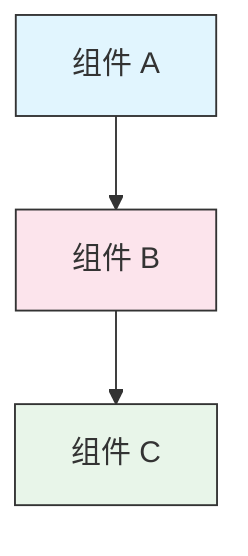

<picture>
  <source media="(prefers-color-scheme: dark)" srcset="resources/logos/claude-howto-logo-dark.svg">
  
</picture>

# 风格指南

> Claude How To 项目的编写规范与格式规则。遵循本指南以保持内容一致、专业且易于维护。

---

## 目录

- [文件与文件夹命名](#文件与文件夹命名)
- [文档结构](#文档结构)
- [标题](#标题)
- [文本格式](#文本格式)
- [列表](#列表)
- [表格](#表格)
- [代码块](#代码块)
- [链接与交叉引用](#链接与交叉引用)
- [图表](#图表)
- [表情符号使用](#表情符号使用)
- [YAML 前置元数据](#yaml-前置元数据)
- [图片与媒体](#图片与媒体)
- [语气与风格](#语气与风格)
- [提交信息](#提交信息)
- [作者自查清单](#作者自查清单)

---

## 文件与文件夹命名

### 课程文件夹

课程文件夹采用**两位数字前缀**加**短横线连接**的描述词：

```
01-slash-commands/
02-memory/
03-skills/
04-subagents/
05-mcp/
```

数字反映了从入门到高级的学习路径顺序。

### 文件名

| 类型 | 规范 | 示例 |
|------|-----------|----------|
| **课程 README** | `README.md` | `01-slash-commands/README.md` |
| **功能文件** | 短横线连接 `.md` | `code-reviewer.md`、`generate-api-docs.md` |
| **Shell 脚本** | 短横线连接 `.sh` | `format-code.sh`、`validate-input.sh` |
| **配置文件** | 标准名称 | `.mcp.json`、`settings.json` |
| **Memory 文件** | 作用域前缀 | `project-CLAUDE.md`、`personal-CLAUDE.md` |
| **顶级文档** | 大写 `.md` | `CATALOG.md`、`QUICK_REFERENCE.md`、`CONTRIBUTING.md` |
| **图片资源** | 短横线连接 | `pr-slash-command.png`、`claude-howto-logo.svg` |

### 规则

- 所有文件和文件夹名称使用**小写字母**（顶级文档如 `README.md`、`CATALOG.md` 除外）
- 使用**连字符**（`-`）作为单词分隔符，切勿使用下划线或空格
- 名称保持描述性但简洁

---

## 文档结构

### 根目录 README

根目录 `README.md` 按以下顺序排列：

1. Logo（`<picture>` 元素，支持深色/浅色模式）
2. H1 标题
3. 引言块引用（一句话价值主张）
4. "Why This Guide?"（为什么选择本指南？）章节，附对比表格
5. 水平分隔线（`---`）
6. 目录
7. 功能目录
8. 快速导航
9. 学习路径
10. 功能章节
11. 快速入门
12. 最佳实践 / 故障排除
13. 贡献 / 许可证

### 课程 README

每个课程 `README.md` 按以下顺序排列：

1. H1 标题（如 `# Slash Commands`）
2. 简要概述段落
3. 快速参考表格（可选）
4. 架构图（Mermaid）
5. 详细章节（H2）
6. 实践示例（编号，4-6 个示例）
7. 最佳实践（该做与不该做的表格）
8. 故障排除
9. 相关指南 / 官方文档
10. 文档元数据页脚

### 功能/示例文件

独立的功能文件（如 `optimize.md`、`pr.md`）：

1. YAML 前置元数据（如适用）
2. H1 标题
3. 用途 / 描述
4. 使用说明
5. 代码示例
6. 自定义技巧

### 章节分隔符

使用水平分隔线（`---`）来分隔文档的主要区域：

```markdown
---

## 新的主要章节
```

将它们放在引言块引用之后，以及文档中逻辑上不同的部分之间。

---

## 标题

### 层级

| 级别 | 用途 | 示例 |
|-------|-----|---------|
| `#` H1 | 页面标题（每篇文档仅一个） | `# Slash Commands` |
| `##` H2 | 主要章节 | `## Best Practices` |
| `###` H3 | 子章节 | `### Adding a Skill` |
| `####` H4 | 子子章节（极少使用） | `#### Configuration Options` |

### 规则

- **每篇文档仅一个 H1** —— 仅用作页面标题
- **切勿跳级** —— 不要从 H2 直接跳到 H4
- **保持标题简洁** —— 力求 2-5 个词
- **使用句子大小写** —— 仅首字母和专有名词大写（例外：功能名称保持原样）
- **仅在根目录 README 的章节标题中**添加表情符号前缀（参见[表情符号使用](#表情符号使用)）

---

## 文本格式

### 强调

| 样式 | 使用场景 | 示例 |
|-------|------------|---------|
| **粗体**（`**文本**`） | 关键术语、表格中的标签、重要概念 | `**安装**：` |
| *斜体*（`*文本*`） | 技术术语首次出现、书籍/文档标题 | `*frontmatter*` |
| `代码`（`` `文本` ``） | 文件名、命令、配置值、代码引用 | `` `CLAUDE.md` `` |

### 用于提示的块引用

使用带粗体前缀的块引用来标注重要说明：

```markdown
> **注意**：自定义斜杠命令自 v2.0 起已合并到 skills 中。

> **重要**：切勿提交 API 密钥或凭据。

> **提示**：将 memory 与 skills 结合使用可获得最大效果。
```

支持的提示类型：**注意**、**重要**、**提示**、**警告**。

### 段落

- 保持段落简短（2-4 句话）
- 段落之间添加空行
- 先给出关键要点，再提供上下文
- 解释"为什么"而不仅仅是"是什么"

---

## 列表

### 无序列表

使用破折号（`-`），嵌套时缩进 2 个空格：

```markdown
- 第一项
- 第二项
  - 嵌套项
  - 另一个嵌套项
    - 深层嵌套（避免超过 3 层）
- 第三项
```

### 有序列表

用于顺序步骤、指令和排名项：

```markdown
1. 第一步
2. 第二步
   - 子要点详情
   - 另一个子要点
3. 第三步
```

### 描述性列表

使用粗体标签实现键值对风格的列表：

```markdown
- **性能瓶颈** - 识别 O(n^2) 操作、低效循环
- **内存泄漏** - 查找未释放的资源、循环引用
- **算法改进** - 建议更优的算法或数据结构
```

### 规则

- 保持一致的缩进（每层 2 个空格）
- 列表前后添加空行
- 列表项结构保持平行（全部以动词开头，或全部为名词等）
- 避免嵌套超过 3 层

---

## 表格

### 标准格式

```markdown
| 列 1 | 列 2 | 列 3 |
|----------|----------|----------|
| 数据     | 数据     | 数据     |
```

### 常用表格模式

**功能对比（3-4 列）：**

```markdown
| 功能 | 调用方式 | 持久性 | 最适合 |
|---------|-----------|------------|----------|
| **斜杠命令** | 手动（`/cmd`） | 仅限当前会话 | 快捷方式 |
| **Memory** | 自动加载 | 跨会话 | 长期学习 |
```

**该做与不该做：**

```markdown
| 该做 | 不该做 |
|----|-------|
| 使用描述性名称 | 使用模糊的名称 |
| 保持文件专注 | 让单个文件承载过多内容 |
```

**快速参考：**

```markdown
| 方面 | 详情 |
|--------|---------|
| **用途** | 生成 API 文档 |
| **范围** | 项目级 |
| **复杂度** | 中级 |
```

### 规则

- 当第一列是行标签时，使用**粗体表头**
- 在源码中对齐竖线以提高可读性（可选但推荐）
- 单元格内容保持简洁；使用链接提供详情
- 单元格内的命令和文件路径使用 `代码格式`

---

## 代码块

### 语言标签

始终指定语言标签以实现语法高亮：

| 语言 | 标签 | 用于 |
|----------|-----|---------|
| Shell | `bash` | CLI 命令、脚本 |
| Python | `python` | Python 代码 |
| JavaScript | `javascript` | JS 代码 |
| TypeScript | `typescript` | TS 代码 |
| JSON | `json` | 配置文件 |
| YAML | `yaml` | 前置元数据、配置 |
| Markdown | `markdown` | Markdown 示例 |
| SQL | `sql` | 数据库查询 |
| 纯文本 | （无标签） | 预期输出、目录树 |

### 惯例

```bash
# 注释说明该命令的作用
claude mcp add notion --transport http https://mcp.notion.com/mcp
```

- 在非显而易见的命令前添加**注释行**
- 所有示例需**可直接复制粘贴**
- 在相关时同时展示**简单和高级**两个版本
- 包含**预期输出**以帮助理解时使用无标签代码块

### 安装代码块

安装说明使用以下模式：

```bash
# 将文件复制到你的项目
cp 01-slash-commands/*.md .claude/commands/
```

### 多步骤工作流

```bash
# 第 1 步：创建目录
mkdir -p .claude/commands

# 第 2 步：复制模板
cp 01-slash-commands/*.md .claude/commands/

# 第 3 步：验证安装
ls .claude/commands/
```

---

## 链接与交叉引用

### 内部链接（相对路径）

所有内部链接使用相对路径：

```markdown
[斜杠命令](01-slash-commands/)
[Skills 指南](03-skills/)
[Memory 架构](02-memory/#memory-architecture)
```

从课程文件夹链接回根目录或同级文件夹：

```markdown
[返回主指南](../README.md)
[相关：Skills](../03-skills/)
```

### 外部链接（绝对路径）

使用完整 URL 并附带描述性锚文本：

```markdown
[Anthropic 官方文档](https://code.claude.com/docs/en/overview)
```

- 切勿使用"点击此处"或"此链接"作为锚文本
- 使用脱离上下文也能理解的描述性文本

### 章节锚点

使用 GitHub 风格的锚点链接到同一文档内的章节：

```markdown
[功能目录](#-feature-catalog)
[最佳实践](#best-practices)
```

### 相关指南模式

课程末尾添加相关指南章节：

```markdown
## 相关指南

- [斜杠命令](../01-slash-commands/) - 快捷操作
- [Memory](../02-memory/) - 持久化上下文
- [Skills](../03-skills/) - 可复用能力
```

---

## 图表

### Mermaid

所有图表使用 Mermaid。支持的图表类型：

- `graph TB` / `graph LR` — 架构图、层次结构图、流程图
- `sequenceDiagram` — 交互流程
- `timeline` — 时间序列

### 样式规范

使用样式块应用一致的颜色：



**调色板：**

| 颜色 | 色号 | 用于 |
|-------|-----|---------|
| 浅蓝 | `#e1f5fe` | 主要组件、输入 |
| 浅粉 | `#fce4ec` | 处理过程、中间件 |
| 浅绿 | `#e8f5e9` | 输出、结果 |
| 浅黄 | `#fff9c4` | 配置、可选组件 |
| 浅紫 | `#f3e5f5` | 面向用户、UI |

### 规则

- 使用 `["标签文本"]` 作为节点标签（支持特殊字符）
- 使用 `<br/>` 在标签内换行
- 保持图表简洁（最多 10-12 个节点）
- 在图表下方添加简短的文字描述以提高可访问性
- 层次结构使用从上到下（`TB`），工作流使用从左到右（`LR`）

---

## 表情符号使用

### 表情符号的使用场景

表情符号**有节制且有目的地**使用——仅在特定场景下使用：

| 场景 | 表情符号 | 示例 |
|---------|--------|---------|
| 根目录 README 章节标题 | 分类图标 | `## 📚 学习路径` |
| 难度等级指示 | 彩色圆圈 | 🟢 入门、🔵 中级、🔴 高级 |
| 该做与不该做 | 勾选/叉号 | ✅ 该做、❌ 不该做 |
| 复杂度评分 | 星号 | ⭐⭐⭐ |

### 标准表情符号集

| 表情符号 | 含义 |
|-------|---------|
| 📚 | 学习、指南、文档 |
| ⚡ | 快速入门、快速参考 |
| 🎯 | 功能、快速参考 |
| 🎓 | 学习路径 |
| 📊 | 统计、对比 |
| 🚀 | 安装、快捷命令 |
| 🟢 | 入门级别 |
| 🔵 | 中级 |
| 🔴 | 高级 |
| ✅ | 推荐做法 |
| ❌ | 避免 / 反模式 |
| ⭐ | 复杂度评分单位 |

### 规则

- **切勿在正文**或段落中使用表情符号
- **仅在根目录 README 的标题中**使用表情符号（课程 README 中不使用）
- **不要添加装饰性表情符号** —— 每个表情符号都应传达含义
- 表情符号使用与上表保持一致

---

## YAML 前置元数据

### 功能文件（Skills、Commands、Agents）

```yaml
---
name: unique-identifier
description: What this feature does and when to use it
allowed-tools: Bash, Read, Grep
---
```

### 可选字段

```yaml
---
name: my-feature
description: Brief description
argument-hint: "[file-path] [options]"
allowed-tools: Bash, Read, Grep, Write, Edit
model: opus                        # opus、sonnet 或 haiku
disable-model-invocation: true     # 仅限用户调用
user-invocable: false              # 在用户菜单中隐藏
context: fork                      # 在隔离的子代理中运行
agent: Explore                     # context: fork 时使用的代理类型
---
```

### 规则

- 将前置元数据放在文件最顶部
- `name` 字段使用**短横线连接**格式
- `description` 保持一句话
- 仅包含必要的字段

---

## 图片与媒体

### Logo 模式

所有以 Logo 开头的文档使用 `<picture>` 元素以支持深色/浅色模式：

```html
<picture>
  <source media="(prefers-color-scheme: dark)" srcset="resources/logos/claude-howto-logo-dark.svg">
  
</picture>
```

### 截图

- 存放在相关课程文件夹中（如 `01-slash-commands/pr-slash-command.png`）
- 文件名使用短横线连接格式
- 包含描述性的替代文本
- 图表优先使用 SVG，截图使用 PNG

### 规则

- 始终为图片提供替代文本
- 保持图片文件大小合理（PNG 不超过 500KB）
- 图片引用使用相对路径
- 将图片与引用它的文档存放在同一目录，或共享图片存放在 `assets/` 中

---

## 语气与风格

### 写作风格

- **专业但亲切** —— 技术准确但不堆砌术语
- **主动语态** —— "创建文件"而非"文件应被创建"
- **直接明了** —— "运行此命令"而非"你可能需要运行此命令"
- **新手友好** —— 假设读者刚接触 Claude Code，但并非编程新手

### 内容原则

| 原则 | 示例 |
|-----------|---------|
| **用示例说话，而非空谈** | 提供可运行的示例，而非抽象描述 |
| **渐进式复杂度** | 从简单开始，在后续章节逐步深入 |
| **解释"为什么"** | "使用 memory 来……因为……"而非仅说"使用 memory 来……" |
| **可直接复制粘贴** | 每个代码块都应能直接粘贴使用 |
| **真实场景** | 使用实际场景，而非编造的示例 |

### 词汇规范

- 使用"Claude Code"（而非"Claude CLI"或"该工具"）
- 使用"skill"（而非"custom command"——旧称）
- 编号章节使用"课程"或"指南"
- 单独的功能文件使用"示例"

---

## 提交信息

遵循 [Conventional Commits](https://www.conventionalcommits.org/)：

```
type(scope): 描述
```

### 类型

| 类型 | 用于 |
|------|---------|
| `feat` | 新功能、新示例或新指南 |
| `fix` | Bug 修复、勘误、失效链接 |
| `docs` | 文档改进 |
| `refactor` | 不改变行为的重构 |
| `style` | 仅格式变更 |
| `test` | 新增或修改测试 |
| `chore` | 构建、依赖、CI |

### 范围

使用课程名称或文件区域作为范围：

```
feat(slash-commands): 添加 API 文档生成器
docs(memory): 改进个人偏好示例
fix(README): 修正目录链接
docs(skills): 添加全面的代码审查 skill
```

---

## 文档元数据页脚

课程 README 以元数据块结尾：

```markdown
---
**最后更新**：2026 年 5 月 29 日
**Claude Code 版本**：2.1.156
**兼容模型**：Claude Sonnet 4.6、Claude Opus 4.8、Claude Haiku 4.5
```

- 使用月 + 日 + 年格式（如"2026 年 5 月 20 日"）
- 功能变更时更新版本
- 列出所有兼容模型

---

## 作者自查清单

提交内容前，请确认：

- [ ] 文件/文件夹名称使用短横线连接格式
- [ ] 文档以 H1 标题开头（每篇文档仅一个）
- [ ] 标题层级正确（无跳级）
- [ ] 所有代码块均有语言标签
- [ ] 代码示例可直接复制粘贴
- [ ] 内部链接使用相对路径
- [ ] 外部链接具有描述性锚文本
- [ ] 表格格式正确
- [ ] 表情符号符合标准集合（如使用）
- [ ] Mermaid 图表使用标准调色板
- [ ] 无敏感信息（API 密钥、凭据）
- [ ] YAML 前置元数据有效（如适用）
- [ ] 图片有替代文本
- [ ] 段落简短且聚焦
- [ ] 相关指南章节链接到对应的课程
- [ ] 提交信息遵循 Conventional Commits 格式

---

**最后更新**：2026 年 5 月 29 日
**Claude Code 版本**：2.1.156
**资料来源**：
- https://code.claude.com/docs/en/overview
- https://code.claude.com/docs/en/changelog
- https://www.anthropic.com/news/claude-opus-4-8
- https://github.com/anthropics/claude-code/releases/tag/v2.1.154
**兼容模型**：Claude Sonnet 4.6、Claude Opus 4.8、Claude Haiku 4.5
