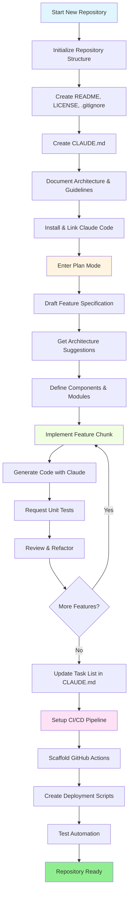
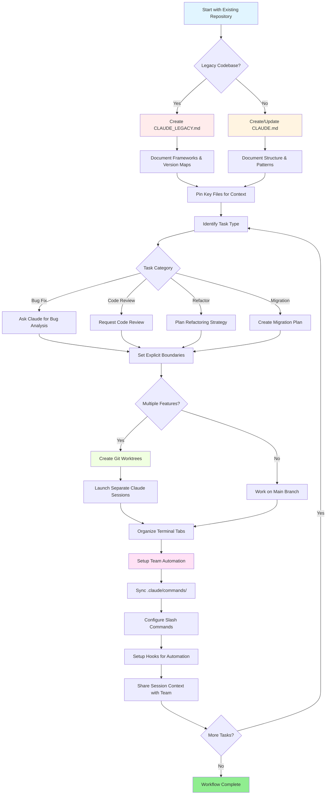

<picture>
  <source media="(prefers-color-scheme: dark)" srcset="resources/logos/claude-howto-logo-dark.svg">
  
</picture>

# 优秀资源列表

## 官方文档

| 资源 | 描述 | 链接 |
|----------|-------------|------|
| Claude Code 文档 | Claude Code 官方文档 | [code.claude.com/docs/en/overview](https://code.claude.com/docs/en/overview) |
| Anthropic 文档 | Anthropic 完整文档 | [docs.anthropic.com](https://docs.anthropic.com) |
| MCP 协议 | 模型上下文协议规范 | [modelcontextprotocol.io](https://modelcontextprotocol.io) |
| MCP 服务器 | 官方 MCP 服务器实现 | [github.com/modelcontextprotocol/servers](https://github.com/modelcontextprotocol/servers) |
| Anthropic Cookbook | 代码示例和教程 | [github.com/anthropics/anthropic-cookbook](https://github.com/anthropics/anthropic-cookbook) |
| Claude Code Skills | 社区技能仓库 | [github.com/anthropics/skills](https://github.com/anthropics/skills) |
| Agent Teams（智能体团队） | 多智能体协调与协作 | [code.claude.com/docs/en/agent-teams](https://code.claude.com/docs/en/agent-teams) |
| Scheduled Tasks（定时任务） | 使用 /loop 和 cron 实现周期性任务 | [code.claude.com/docs/en/scheduled-tasks](https://code.claude.com/docs/en/scheduled-tasks) |
| Chrome 集成 | 浏览器自动化 | [code.claude.com/docs/en/chrome](https://code.claude.com/docs/en/chrome) |
| 键位绑定 | 键盘快捷键自定义 | [code.claude.com/docs/en/keybindings](https://code.claude.com/docs/en/keybindings) |
| 桌面应用 | 原生桌面应用程序 | [code.claude.com/docs/en/desktop](https://code.claude.com/docs/en/desktop) |
| 远程控制 | 远程会话控制 | [code.claude.com/docs/en/remote-control](https://code.claude.com/docs/en/remote-control) |
| 自动模式 | 自动权限管理 | [code.claude.com/docs/en/permissions](https://code.claude.com/docs/en/permissions) |
| Channels（频道） | 多频道通信 | [code.claude.com/docs/en/channels](https://code.claude.com/docs/en/channels) |
| 语音听写 | Claude Code 语音输入 | [code.claude.com/docs/en/voice-dictation](https://code.claude.com/docs/en/voice-dictation) |

## Anthropic 工程博客

| 文章 | 描述 | 链接 |
|---------|-------------|------|
| 使用 MCP 执行代码 | 如何通过代码执行解决 MCP 上下文膨胀问题——节省 98.7% 的 Token 用量 | [anthropic.com/engineering/code-execution-with-mcp](https://www.anthropic.com/engineering/code-execution-with-mcp) |

---

## 30 分钟掌握 Claude Code

_视频_: https://www.youtube.com/watch?v=6eBSHbLKuN0

_**所有技巧**_
- **探索高级功能与快捷键**
  - 定期查阅 Claude 发布说明中的新代码编辑和上下文功能。
  - 学习键盘快捷键，以便在聊天、文件和编辑器视图间快速切换。

- **高效配置**
  - 创建带有清晰名称/描述的特定项目会话，便于后续检索。
  - 固定最常用的文件或文件夹，让 Claude 随时都能访问它们。
  - 配置 Claude 的集成功能（如 GitHub、常用 IDE）以简化编码流程。

- **高效的代码库问答**
  - 向 Claude 提出关于架构、设计模式和特定模块的详细问题。
  - 在问题中使用文件和行号引用（例如："`app/models/user.py` 中的逻辑实现了什么功能？"）。
  - 对于大型代码库，提供摘要或清单以帮助 Claude 聚焦。
  - **示例提示词**: _"你能解释一下 `src/auth/AuthService.ts:45-120` 中实现的认证流程吗？它是如何与 `src/middleware/auth.ts` 中的中间件集成的？"_

- **代码编辑与重构**
  - 在代码块中使用行内注释或请求来获得精准编辑（"重构此函数以提高清晰度"）。
  - 请求并排的修改前后对比。
  - 在重大编辑后让 Claude 生成测试或文档以确保质量。
  - **示例提示词**: _"将 `api/users.js` 中的 `getUserData` 函数重构为使用 async/await 而非 promise。给我展示修改前后对比，并为重构后的版本生成单元测试。"_

- **上下文管理**
  - 将粘贴的代码/上下文限制为仅与当前任务相关的内容。
  - 使用结构化的提示词（"这是文件 A，这是函数 B，我的问题是 X"）以获得最佳效果。
  - 在提示窗口中移除或折叠大型文件，避免超出上下文限制。
  - **示例提示词**: _"这是来自 `models/User.js` 的 User 模型和来自 `utils/validation.js` 的 `validateUser` 函数。我的问题是：如何在保持向后兼容性的同时添加邮箱验证？"_

- **集成团队工具**
  - 将 Claude 会话连接到团队的仓库和文档。
  - 使用内置模板或创建自定义模板以完成重复的工程任务。
  - 通过与团队成员共享会话记录和提示词进行协作。

- **提升性能**
  - 给 Claude 清晰、目标导向的指令（例如："用五个要点总结这个类"）。
  - 从上下文窗口中删除不必要的注释和样板代码。
  - 如果 Claude 的输出偏离方向，重置上下文或重新表述问题以获得更好的一致性。
  - **示例提示词**: _"用五个要点总结 `src/db/Manager.ts` 中的 `DatabaseManager` 类，重点介绍其主要职责和关键方法。"_

- **实际使用示例**
  - 调试：粘贴错误和堆栈跟踪，然后询问可能的原因和修复方案。
  - 测试生成：为复杂逻辑请求基于属性的测试、单元测试或集成测试。
  - 代码审查：让 Claude 识别有风险的更改、边界情况或代码异味。
  - **示例提示词**:
    - _"我遇到了这个错误：`'TypeError: Cannot read property 'map' of undefined at line 42 in components/UserList.jsx'`。这是堆栈跟踪和相关代码。是什么导致了这个问题，我该如何修复？"_
    - _"为 `PaymentProcessor` 类生成全面的单元测试，包括失败交易、超时和无效输入等边界情况。"_
    - _"审查这个拉取请求的差异，识别潜在的安全问题、性能瓶颈和代码异味。"_

- **工作流自动化**
  - 使用 Claude 提示词编写重复性任务脚本（如格式化、清理和批量重命名）。
  - 使用 Claude 基于代码差异起草 PR 描述、发布说明或文档。
  - **示例提示词**: _"基于 git diff，创建一个详细的 PR 描述，包含变更摘要、修改文件列表、测试步骤和潜在影响。同时为 2.3.0 版本生成发布说明。"_

**提示**：为获得最佳效果，请结合使用以上多种实践——从固定关键文件和总结目标开始，然后使用聚焦的提示词和 Claude 的重构工具逐步改进你的代码库和自动化水平。

**Claude Code 推荐工作流**

### Claude Code 推荐工作流

#### 新建仓库

1. **初始化仓库与 Claude 集成**
   - 设置新仓库的基本结构：README、LICENSE、.gitignore、根配置文件。
   - 创建一个 `CLAUDE.md` 文件，描述架构、高层目标和编码规范。
   - 安装 Claude Code 并将其关联到你的仓库，用于代码建议、测试脚手架和工作流自动化。

2. **使用计划模式和规格说明**
   - 在实现功能之前，使用计划模式（`shift-tab` 或 `/plan`）起草详细的规格说明。
   - 向 Claude 征求架构建议和初始项目布局。
   - 保持清晰、目标导向的提示词序列——请求组件大纲、主要模块和职责划分。

3. **迭代开发与审查**
   - 以小模块为单位实现核心功能，通过提示词让 Claude 生成代码、进行重构和编写文档。
   - 每次增量完成后请求单元测试和示例。
   - 在 CLAUDE.md 中维护一个持续更新的任务列表。

4. **自动化 CI/CD 和部署**
   - 使用 Claude 搭建 GitHub Actions、npm/yarn 脚本或部署工作流。
   - 通过更新 CLAUDE.md 并请求相应的命令/脚本，轻松调整流水线配置。

#### 现有仓库

1. **仓库与上下文配置**
   - 添加或更新 `CLAUDE.md` 以记录仓库结构、编码模式和关键文件。对于遗留仓库，使用 `CLAUDE_LEGACY.md` 涵盖框架、版本映射、说明、已知缺陷和升级说明。
   - 固定或高亮 Claude 应用于上下文的主要文件。

2. **基于上下文的代码问答**
   - 向 Claude 请求代码审查、缺陷解释、重构或迁移计划，引用特定文件/函数。
   - 给 Claude 设定明确的边界（例如："仅修改这些文件"或"不要添加新依赖"）。

3. **分支、工作树和多会话管理**
   - 使用多个 Git 工作树来隔离不同的功能或缺陷修复，并为每个工作树启动独立的 Claude 会话。
   - 按分支或功能组织终端标签页/窗口，实现并行工作流。

4. **团队工具与自动化**
   - 通过 `.claude/commands/` 同步自定义命令，保持跨团队一致性。
   - 通过 Claude 的斜杠命令或钩子自动执行重复性任务、PR 创建和代码格式化。
   - 与团队成员共享会话和上下文，进行协作式故障排查和审查。

**提示**:
- 每项新功能或修复都以规格说明和计划模式提示词开始。
- 对于遗留和复杂仓库，在 CLAUDE.md/CLAUDE_LEGACY.md 中存储详细指导。
- 给出清晰、聚焦的指令，将复杂工作分解为多阶段计划。
- 定期清理会话、精简上下文并删除已完成的工作树，避免杂乱。

以上步骤涵盖了在新建和现有代码库中使用 Claude Code 实现顺畅工作流的核心建议。

---

## 新功能与能力（2026 年 5 月）

### 主要功能资源

| 功能 | 描述 | 了解更多 |
|---------|-------------|------------|
| **自动记忆** | Claude 自动学习并在跨会话中记住你的偏好 | [Memory Guide](02-memory/) |
| **远程控制** | 从外部工具和脚本以编程方式控制 Claude Code 会话 | [Advanced Features](09-advanced-features/) |
| **Web 会话** | 通过基于浏览器的界面访问 Claude Code 进行远程开发 | [CLI Reference](10-cli/) |
| **桌面应用** | Claude Code 原生桌面应用程序，具有增强的用户界面 | [Claude Code Docs](https://code.claude.com/docs/en/desktop) |
| **深度思考** | 通过 `Alt+T`/`Option+T` 或 `MAX_THINKING_TOKENS` 环境变量切换深度推理模式 | [Advanced Features](09-advanced-features/) |
| **权限模式** | 细粒度控制：default、acceptEdits、plan、auto、dontAsk、bypassPermissions | [Advanced Features](09-advanced-features/) |
| **7 层记忆体系** | 托管策略、项目、项目规则、用户、用户规则、本地、自动记忆 | [Memory Guide](02-memory/) |
| **Hook 事件** | 29 个事件：PreToolUse、PostToolUse、PostToolUseFailure、Stop、StopFailure、SubagentStart、SubagentStop、Notification、Elicitation 等 | [Hooks Guide](06-hooks/) |
| **智能体团队** | 协调多个智能体协同处理复杂任务 | [Subagents Guide](04-subagents/) |
| **定时任务** | 使用 `/loop` 和 cron 工具设置周期性任务 | [Advanced Features](09-advanced-features/) |
| **Chrome 集成** | 使用无头 Chromium 进行浏览器自动化 | [Advanced Features](09-advanced-features/) |
| **键盘自定义** | 自定义键位绑定，包括和弦序列 | [Advanced Features](09-advanced-features/) |
| **Monitor 工具** | 监听后台命令的 stdout 流并对事件做出反应，而非轮询（v2.1.98+） | [Advanced Features](09-advanced-features/) |
| **/goal 模式** | 注册会话级别的完成条件；Claude 将持续工作直到条件满足（v2.1.139+） | [Slash Commands](01-slash-commands/) |
| **claude agents（智能体视图）** | 从终端列出、检查并恢复后台智能体；`--json` 用于机器可读输出（v2.1.139+，`--json` 在 v2.1.145 中添加） | [code.claude.com/docs/en/agent-view](https://code.claude.com/docs/en/agent-view) |
| **/run、/verify、/run-skill-generator** | 用于启动项目、确认修复有效以及按项目生成 run/verify 技能的内置技能（v2.1.145+） | [Skills Guide](03-skills/) |

---
**最后更新**: 2026 年 6 月 2 日
**Claude Code 版本**: 2.1.160
**来源**:
- https://code.claude.com/docs/en/overview
- https://code.claude.com/docs/en/changelog
- https://code.claude.com/docs/en/agent-view
- https://github.com/anthropics/claude-code/releases/tag/v2.1.144
- https://github.com/anthropics/claude-code/releases/tag/v2.1.145
**兼容模型**: Claude Sonnet 4.6、Claude Opus 4.8、Claude Haiku 4.5
